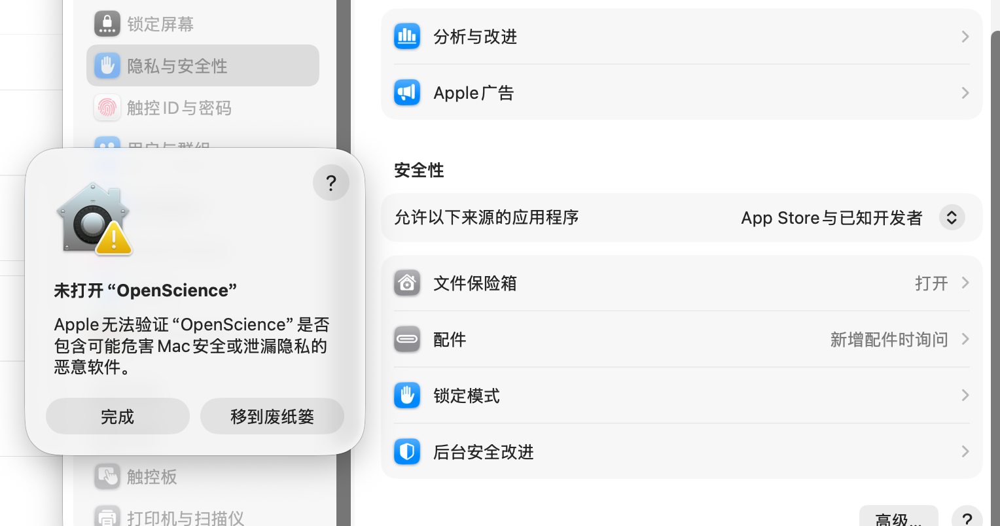

# OpenScience 直接安装指南

[English](README.md)

这份说明面向不从源码构建、而是直接下载桌面安装包的用户。推荐从 GitHub Releases 获取最新版：

[https://github.com/ResearAI/OpenScience/releases](https://github.com/ResearAI/OpenScience/releases)

## macOS

1. 打开 Releases 页面，下载适合当前 Mac 的安装包。
   - Apple Silicon 机型通常选择 `arm64`。
   - Intel 机型通常选择 `x64`。
2. 打开下载的安装包，把 OpenScience 拖入 `Applications`。
3. 第一次启动时，macOS 可能会提示无法验证开发者，或提示 OpenScience 未打开。



4. 不要选择移到废纸篓。点击“完成”后，打开：

   `系统设置` -> `隐私与安全性` -> `安全性`

5. 在“已阻止 OpenScience 以保护 Mac”附近点击“仍要打开”。


6. 系统可能会要求 Touch ID、密码或再次确认“打开”。完成后，OpenScience 就可以正常启动。

如果“仍要打开”没有出现，可以再双击一次 OpenScience，触发一次拦截提示后再回到 `隐私与安全性` 页面查看。

## Windows

1. 从 Releases 下载 Windows 安装包。
2. 双击运行安装包。
3. 如果出现 Microsoft Defender SmartScreen 提示，选择“更多信息”，再选择“仍要运行”。
4. 如果浏览器提示下载文件不常见，请确认来源是 `ResearAI/OpenScience` 的 Releases 页面后选择保留。

## Linux

1. 从 Releases 下载适合当前 Linux 架构的 `.deb` 安装包。
2. Debian / Ubuntu 用户可以使用：

   ```bash
   sudo apt install ./OpenScience-*.deb
   ```

3. 从应用菜单启动 OpenScience，或者在终端运行：

   ```bash
   OpenScience
   ```

4. 桌面应用默认会启动本机 WebUI。进入**设置 -> 远程连接 -> WebUI**，即可复制浏览器访问地址。
5. 如果你希望只用浏览器访问，或在无图形 Linux 服务器上运行，可以显式启动 WebUI：

   ```bash
   OpenScience --webui --port 25808
   OpenScience --webui --remote --port 25808
   ```

   第一条用于本机浏览器访问。只有需要其他设备、反向代理或 SSH 隧道访问时，才使用 `--remote`。
6. 如果系统安全策略阻止运行，请在文件属性、软件中心或系统安全设置中允许来自该文件的应用运行。

## 安全提示

- 请优先从 GitHub Releases 下载，不要使用来源不明的安装包。
- macOS、Windows 和部分 Linux 桌面环境都会对未完全签名或新发布的软件做安全拦截；这类拦截通常需要用户在系统安全设置里手动确认。
- WebUI 默认只用于本机访问。只有在可信网络、SSH 隧道或自己控制的反向代理后面，才建议开启远程访问。
- 如果安装后无法启动，先重新下载最新版，再检查系统安全设置、杀毒软件隔离区和文件执行权限。
