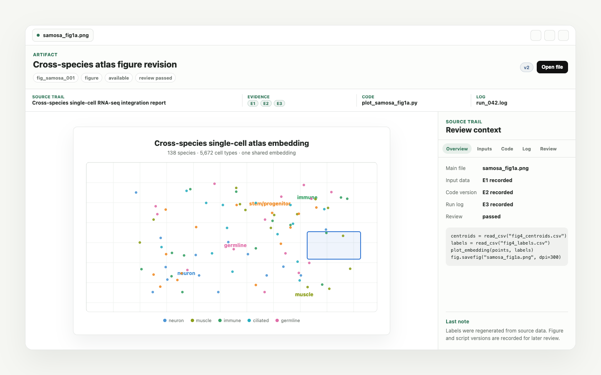
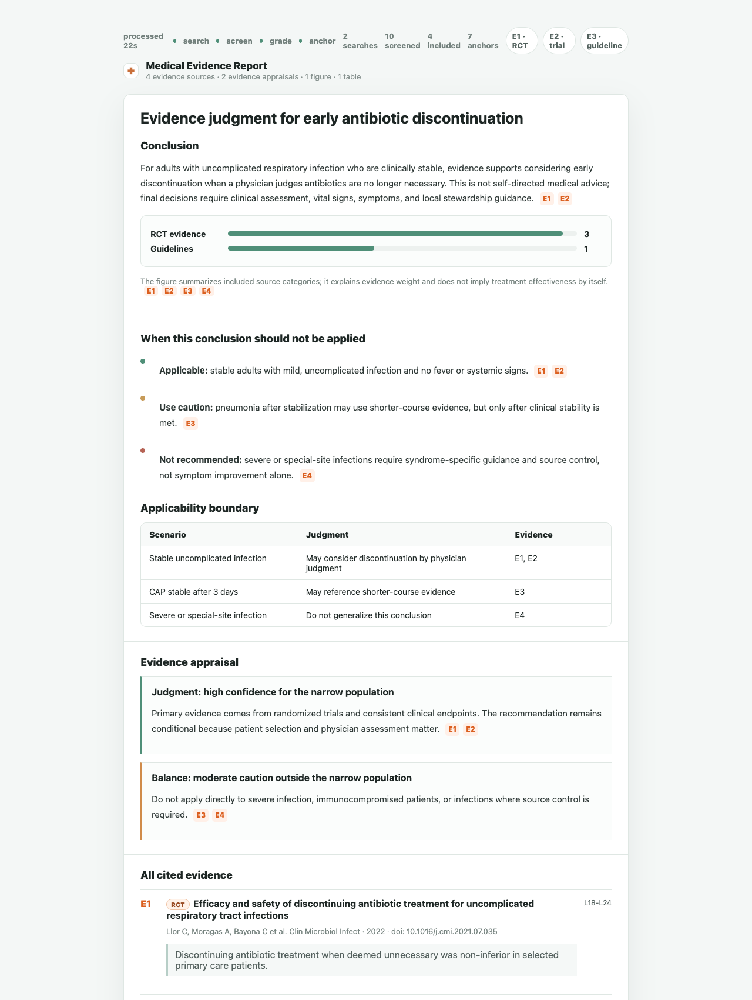

<p align="center">
  
</p>

<p align="center">
  <strong>面向多学科科研的开源 AI 研究工作台。</strong>
</p>

<p align="center">
  OpenScience 把本地研究项目变成一个可以读文献、查证据、跑分析、预览文件、修改图表、写报告和手稿，并保留来源、代码、数据和运行记录的科学工作空间。
</p>

<p align="center">
  
</p>

<p align="center">
  <a href="../../readme.md">English</a> · <strong>简体中文</strong> · <a href="./readme_tw.md">繁體中文</a> · <a href="./readme_jp.md">日本語</a> · <a href="./readme_ko.md">한국어</a> · <a href="./readme_es.md">Español</a> · <a href="./readme_pt.md">Português</a> · <a href="./readme_tr.md">Türkçe</a> · <a href="./readme_ru.md">Русский</a> · <a href="./readme_uk.md">Українська</a>
</p>

---

## 主线

OpenScience 借鉴 Claude Science 强调的方向：科学 AI 不应该只是聊天框，而应该是一个研究环境。它需要能围绕研究项目运行分析、搜索证据、生成可检查的科学 artifact、预览科学文件，并把计算、证据和审查记录留在项目里。

它应该能被不同学科的研究者自然使用：生物学用户会关心基因列表、AnnData、UMAP 和 marker genes；临床和循证用户会关心指南、RCT、说明书、禁忌证和证据强度；化学用户会关心 SMILES、SDF、ChEMBL、assay 和 ADMET；工程用户会关心参数扫描、求解器日志和仿真图；社会科学用户会关心问卷、codebook、DiD、IV、RDD 和复现包。OpenScience 的核心不是把这些名词堆在界面上，而是让结果能回到对应的来源、数据、代码和记录。

| 科研问题             | OpenScience 的做法                                                   |
| -------------------- | -------------------------------------------------------------------- |
| 工作放在哪里         | 放在研究项目文件夹里，而不是只在聊天记录里                           |
| 能否跑真实分析       | 通过 Python、R、shell、notebook 和本地 coding agent 执行             |
| 结果能否复查         | 图、表、notebook、报告、手稿都作为 artifact 打开并带来源轨迹         |
| 医学/临床证据怎么办  | 使用医学循证模式，生成带证据强度和冲突记录的结构化报告               |
| 做对的流程能否留下来 | 使用知识沉淀模式，把对话、项目材料和 artifact 转成可复用的本地 skill |
| 能否接入现有工具     | 复用本地文件、已有脚本、模型服务和 coding agent 工作流               |

## 能力地图

OpenScience 不是单一用途助手，而是面向多学科科研的完整工作台。Science Mode 当前包含 **352 个默认科研 skills**，覆盖 **10+ 学科方向**，并把证据检索、本地分析、项目记录、审查和导出连接成同一个工作流。

<p align="center">
  
</p>

| 层级     | OpenScience 覆盖内容                                                                                       |
| -------- | ---------------------------------------------------------------------------------------------------------- |
| 工作模式 | 科学研究模式、医学循证模式、目标模式、知识沉淀模式                                                         |
| 学科方向 | 生命科学、化学、药物发现、结构生物学、基因组学、单细胞、工程计算、数据科学、社会科学、计量经济学、因果推断 |
| 证据来源 | PubMed、ChEMBL、GEO、AlphaFold，以及可路由的 20+ 科研数据库族                                              |
| 输出结果 | 循证报告、图表、表格、Notebook、手稿、代码日志、项目记录                                                   |
| 本地优先 | 本地文件、本地 agent、本地项目文件夹，以及可选的模型/Provider 配置                                         |

---

## 不同学科可以怎么用

OpenScience 第一阶段的重点是研究项目、证据报告、科研结果预览、本地代码执行、导出和可沉淀的技能。不同学科的专用 viewer、远程计算和更深的数据库连接，可以在这个基础上逐步增强。

| 学科方向           | OpenScience 应该理解的任务语言                                                    | 常见产出                                              |
| ------------------ | --------------------------------------------------------------------------------- | ----------------------------------------------------- |
| 医学循证和生物医学 | 指南、RCT、队列研究、药品说明书、禁忌证、终点、亚组、GRADE、FDA/EMA 文档          | 循证报告、证据表、建议摘要、冲突和限制说明            |
| 单细胞和基因组学   | scRNA-seq、AnnData、UMAP、marker genes、batch effect、FASTQ/BAM/VCF、GEO、Ensembl | 分析 notebook、QC 表、marker 列表、图表面板、方法描述 |
| 蛋白和结构生物学   | FASTA、PDB/mmCIF、AlphaFold、结构域、binding pocket、alignment、mutation          | 结构说明、序列表、模型对比、可发表图表                |
| 化学和药物发现     | SMILES、SDF、ChEMBL、assay、docking、ADMET、scaffold、SAR                         | 分子表、筛选理由、实验摘要、导出 CSV、审查记录        |
| 生态和系统发育     | 物种树、trait matrix、sequence alignment、栖息地变量、bootstrap                   | 系统发育树图、alignment 记录、数据审计、可复现脚本    |
| 工程和仿真         | mesh、solver、边界条件、参数扫描、残差、CFD/FEA、传感器日志                       | 参数表、运行日志、曲线图、技术报告                    |
| 社会科学和实证研究 | 问卷、codebook、panel data、DiD、IV、RDD、robustness、replication package         | 模型表、稳健性附录、codebook 说明、复现报告           |
| AI、机器学习和系统 | baseline、ablation、benchmark、seed、GPU run、latency、error analysis             | 实验表、排行榜、图表、论文结果总结                    |

---

## 产品预览

<table>
<tr>
<td width="50%" valign="top">
<br/>
<sub><b>科研结果面板。</b> 普通预览框可以变成科研结果视图，右侧保留来源、代码、日志和审查状态。</sub>
</td>
<td width="50%" valign="top">
<br/>
<sub><b>医学循证模式。</b> 把临床和生物医学问题整理成带来源、证据强度、冲突和结论的报告。</sub>
</td>
</tr>
</table>

---

## 研究项目流程

| 步骤 | 研究者做什么       | OpenScience 保留什么                                 |
| ---: | ------------------ | ---------------------------------------------------- |
|    1 | 创建或打开研究项目 | 项目文件夹、设置、来源记录、输出                     |
|    2 | 用自然语言提出问题 | 任务、假设、文件、澄清回答                           |
|    3 | 搜索和读取证据     | 论文、试验、监管文档、数据、图像、代码运行的来源标签 |
|    4 | 运行分析           | 脚本、命令、notebook、输入文件、日志、环境信息       |
|    5 | 检查 artifact      | 图、表、报告、手稿、来源轨迹和审查状态               |
|    6 | 修改并导出         | 新版本、批注、PDF、Word、LaTeX、notebook、项目记录   |

---

## 科研结果不是普通附件

OpenScience 里的 artifact 更接近“可以重新打开的科研结果对象”。它可以是图、表、PDF、Markdown 报告、notebook、手稿或一组导出文件，但它不应该只是孤立文件；它还应该带着生成它的代码、输入、运行日志、环境说明、对话记录和审查状态。

| Artifact 面板 | 用途                                                          |
| ------------- | ------------------------------------------------------------- |
| 预览          | 直接查看图表、报告、PDF、notebook、Markdown、手稿或生成文件   |
| 代码          | 查看或下载生成结果的脚本、notebook cell、shell 命令或生成方案 |
| 输入          | 打开数据集、来源文档、配置文件，或这个结果依赖的上游 artifact |
| 运行日志      | 检查运行了什么、哪里失败、写出了哪些文件、版本有没有变化      |
| 环境          | 记录包、kernel、模型、本机或 agent 环境，方便以后复现         |
| 消息          | 保留任务请求、澄清、修改意见和关键对话                        |
| 审查          | 记录警告、来源不一致、未解决问题和人工批注                    |

---

## 证据优先

数字不是口号，而是支撑“每个关键结论都能回到来源”的能力。

| 证据范围             | 用途                                               |
| -------------------- | -------------------------------------------------- |
| 11M+ 论文            | 文献综述、方法比较、引用支撑写作                   |
| 225K+ 药品和器械文档 | 标签、指南、监管背景、安全性和适应症审查           |
| 1M+ 临床试验         | 干预、结局、状态、对照和入排标准检查               |
| 150M+ 研究摘要       | 快速发现相关方向                                   |
| 本地文件和生成结果   | 数据集、脚本、图表、notebook、报告、日志和审查记录 |

| 研究对象       | OpenScience 应该保留的连接                                       |
| -------------- | ---------------------------------------------------------------- |
| 论文或临床来源 | PMID、DOI、指南段落、临床试验记录、FDA 说明书、摘要、上传的 PDF  |
| 数据集或表格   | CSV/TSV、AnnData metadata、assay 表、问卷 codebook、仿真参数     |
| 生物学对象     | 基因列表、marker 表、FASTA 序列、PDB/mmCIF 结构、alignment       |
| 化学对象       | SMILES、SDF、scaffold、assay 结果、docking score、ADMET 过滤条件 |
| 代码和运行记录 | 脚本、notebook cell、shell 命令、环境说明、运行日志、导出的图    |

---

## 四种工作模式

OpenScience 的模式不是简单换一套提示词，而是给 Agent 换一套工作纪律：它会决定要不要绑定研究项目、要不要记录 artifact、要不要查证据、要不要持续推进，以及最后应该交付什么。

| 模式         | 一句话                                              | 适合什么时候打开                                         | 最终得到什么                                       |
| ------------ | --------------------------------------------------- | -------------------------------------------------------- | -------------------------------------------------- |
| 科学研究模式 | 把自然语言问题推进成真实执行过、可复查的科研结果    | 文献综述、数据分析、计算实验、图表、Notebook、论文初稿   | 带来源、代码、日志和版本记录的科研 artifact        |
| 医学循证模式 | 把医学问题拆成可追溯证据链，而不是只给一个笼统建议  | 治疗方案、药品用法、指南/RCT/说明书对照、风险与禁忌核查  | 带证据等级、冲突记录、限制条件和引用锚点的循证报告 |
| 目标模式     | 让 Agent 围绕一个长期目标持续检查、总结并推进下一步 | 多轮实验、论文修改、项目排期、长期资料整理、连续迭代任务 | 每轮进展、下一步行动、阻塞点和可恢复的持续目标     |
| 知识沉淀模式 | 把你的消息、对话历史和项目材料沉淀成定制化 skill    | 实验室流程、图表风格、审稿回应、数据清洗、团队规范       | 可审查的 skill 草稿、SOP、来源账本、隐私与冲突说明 |

<table>
<tr>
<td width="50%" valign="top">
<br/>
<sub><b>科学研究模式</b>：把搜索、代码运行、图表、Notebook、报告、日志和版本放在同一个研究项目里。</sub>
</td>
<td width="50%" valign="top">
<br/>
<sub><b>医学循证模式</b>：对照指南、RCT、说明书、监管文档和安全边界，再生成可追溯回答。</sub>
</td>
</tr>
<tr>
<td width="50%" valign="top">
<br/>
<sub><b>目标模式</b>：让长期目标、进展、阻塞、决策和下一步行动在多轮工作中持续保留。</sub>
</td>
<td width="50%" valign="top">
<br/>
<sub><b>知识沉淀模式</b>：把有价值的对话、protocol 或团队偏好变成可审查、可启用的本地 skill。</sub>
</td>
</tr>
</table>

### 科学研究模式

科学研究模式是默认的研究项目入口。你可以直接说“帮我分析这批数据”“复现这篇文章的图”“把这个结果整理成 manuscript draft”，OpenScience 会把对话、文件、代码运行、图表、表格、Notebook 和报告都放回同一个研究项目里。

它最重要的价值是：**结果不是聊天记录里的几段文字，而是可以继续打开、检查、修改、导出和复现的科研 artifact。** 每个关键结论都应尽量连接到输入数据、执行命令、环境信息和证据来源；几周后回到项目里，仍然能看清当时是怎么得到这个结果的。

### 医学循证模式

<p align="center">
  
</p>

医学循证模式适合临床、生物医学和监管相关问题。它会更严格地区分“指南怎么说”“RCT 或系统综述怎么说”“药品说明书/监管文档怎么说”“哪些人群需要谨慎处理”，并把证据锚点直接挂在段落后面。

这种模式的输出重点不是“给一个看似确定的答案”，而是帮助你快速看到：

- 主要结论是什么，以及它适用于哪些前提；
- 证据来自指南、RCT、综述、说明书、监管文档还是其他来源；
- 不同来源之间有没有冲突，冲突会不会影响结论；
- 儿童、妊娠、老年、肝肾功能异常、合并用药等边界条件是否需要单独处理；
- 哪些地方只能作为研究和讨论线索，不能替代临床判断。

### 目标模式

目标模式适合“不是一次回答就结束”的任务。你写下一个长期目标后，Agent 每一轮都会带着这个目标继续检查现状：已经完成什么、还有什么没做、下一步应该推进哪里、是否需要先问你确认。

它适合论文返修、长期实验、持续调研、项目周推进、资料库整理这类任务。好处是 Agent 不会每次都从零开始理解上下文，也不会把“下一步”散落在聊天里；目标、进展和阻塞点会被持续保留下来，方便暂停、恢复和交接。

### 知识沉淀模式

知识沉淀模式用于把一次成功经验变成可复用能力。它不只是“总结对话”，而是把你的当前指令、完整对话历史、项目文件、已经生成的 artifact、补充说明和团队偏好，整理成一份可以反复调用的本地定制 skill。

比如你刚完成了一套图表规范、一个实验分析流程、一份审稿回应策略，或者一套团队内部 SOP，就可以让 OpenScience 从这些材料里提炼出能力草稿。这个草稿应该说明：什么时候使用这个 skill、按什么步骤执行、依赖哪些来源或 protocol、有哪些示例、哪些信息需要保密、哪些地方还需要人工确认。

| 对话里发生了什么                 | 可以沉淀成什么                                       |
| -------------------------------- | ---------------------------------------------------- |
| 你讲清楚了实验室如何清洗一类数据 | 数据清洗 SOP，带检查点和常见失败情况                 |
| 你反复修改图表直到符合团队风格   | 图表打磨 skill，带配色、字体、布局和导出要求         |
| 你处理了一条审稿意见             | 审稿回应 skill，带证据要求、回应结构和语气边界       |
| 你描述了一套湿实验或计算流程     | Protocol skill，带输入、步骤、质量门槛和安全注意事项 |
| 你摸索出一套文献检索和筛选路线   | 文献筛选 skill，带优先数据库、排除规则和记录格式     |

沉淀结果不会直接启用。它会先生成可审查的内容：SOP、来源账本、隐私说明、冲突记录和待确认项。你确认后，它才会成为后续 Agent 可以调用的本地能力。这样团队不是只“完成了一次任务”，而是把做对的方式留下来，让下次更快、更一致、更可审查。

---

## 快速开始

### 方式一：安装桌面应用

最快的方式是从 [GitHub Releases](https://github.com/ResearAI/OpenScience/releases) 下载安装包。按你的系统选择对应文件：

| 系统                | 下载文件                    |
| ------------------- | --------------------------- |
| macOS Apple Silicon | `OpenScience-*-arm64.dmg`   |
| macOS Intel         | `OpenScience-*-x64.dmg`     |
| Windows             | `OpenScience-*-x64.exe`     |
| Linux               | `OpenScience-*-linux-*.deb` |

安装后直接打开 OpenScience。现在不需要应用级登录，启动后会直接进入主页。你可以新建或打开研究项目，然后选择**科学研究模式**、**医学循证模式**、**目标模式**或**知识沉淀模式**开始工作。

如果你从源码运行，并且需要执行 Playwright 浏览器测试或独立截图自动化，请在 `bun install --frozen-lockfile` 后单独执行：

```bash
bun run playwright:install
```

普通 Electron 启动、Science artifact 预览和文件预览不依赖这一步。设置页复制的 Playwright MCP 配置会连接 OpenScience 本地 Chrome DevTools 端点，而不是额外启动一个浏览器。

第一次真正调用 Agent 前，建议先进入**设置**，配置至少一个模型提供商、本地模型服务，或 Claude Code、Codex、Qwen Code 等本地 coding agent。如果 Releases 页面暂时还没有安装包，请使用下面的源码运行方式。

### 方式二：从源码运行

```bash
git clone https://github.com/ResearAI/OpenScience.git
cd OpenScience
bun install --frozen-lockfile
bun run start
```

需要提前安装 Git 和 Bun。如果没有 Bun，可以先按 <https://bun.sh/docs/installation> 安装，然后重新运行上面的命令。

如果你希望启动一个不复用桌面数据目录的干净 WebUI 版本，可以使用：

```bash
DEEPORGANISER_DATA_DIR=/tmp/openscience-webui-clean bun run webui -- --port 25809
```

WebUI 启动时会自动同步内置 OpenScience skills 和内置 MCP catalog。普通安装时不要运行 `bun run skills:science:materialize`；这个脚本是维护者重新生成 vendored science skill pack 时使用的。

第一次真正运行科学研究或医学循证任务前，请至少安装并登录一个本地 coding agent，例如 Codex CLI（`codex`）、Claude Code（`claude`）或 OpenCode（`opencode`）。OpenScience 可以先打开，但科研执行需要这些 agent 后端或已经配置好的模型/Provider。

### 从源码构建安装包

OpenScience 使用 `electron-vite` 编译桌面端主进程、预加载脚本和前端页面，再用 `electron-builder` 生成安装包。构建前需要 Node.js 22+、Bun、Git，以及目标平台对应的系统构建工具。

```bash
git clone https://github.com/ResearAI/OpenScience.git
cd OpenScience
bun install --frozen-lockfile
```

常用构建命令：

| 目标平台            | 命令                      | 输出                                        |
| ------------------- | ------------------------- | ------------------------------------------- |
| macOS Apple Silicon | `bun run build-mac:arm64` | `out/OpenScience-*-mac-arm64.dmg` 和 `.zip` |
| macOS Intel         | `bun run build-mac:x64`   | `out/OpenScience-*-mac-x64.dmg` 和 `.zip`   |
| macOS 双架构        | `bun run build-mac`       | arm64 + x64 macOS 安装包                    |
| Windows x64         | `bun run build-win:x64`   | `out/OpenScience-*-win-x64.exe` 和 `.zip`   |
| Windows ARM64       | `bun run build-win:arm64` | `out/OpenScience-*-win-arm64.exe` 和 `.zip` |
| Linux 当前架构      | `bun run build-deb`       | `out/OpenScience-*-linux-*.deb`             |

桌面安装包必须包含匹配平台和架构的 OpenScience Core runtime。构建脚本会读取根目录 `package.json` 里的 `deepOrganiserCoreVersion`，自动下载对应二进制，并放到 `resources/bundled-deeporganiser-core/<platform>-<arch>/`。如果 GitHub 下载受限或访问私有资源，请设置 `GH_TOKEN` 或 `GITHUB_TOKEN`。

发布级安装包建议在原生平台或 GitHub Actions 手动构建工作流中生成：

| 平台           | 推荐构建环境                                    |
| -------------- | ----------------------------------------------- |
| macOS `.dmg`   | macOS runner 或 Mac 本机                        |
| Windows `.exe` | Windows runner + Visual Studio 2022 Build Tools |
| Linux `.deb`   | Ubuntu/Debian 环境                              |

本地测试可以不签名；正式发布时，macOS 建议配置 Apple 签名和 notarization，Windows 需要 MSVC 工具链，Linux 需要 Debian 打包和 Electron/GTK 相关依赖。

### 让 Claude Code 或 Codex 帮你安装

如果你不熟悉终端，可以把下面这段话直接发给 Claude Code、Codex 或其他本地 coding agent：

```text
请帮我在这台电脑上安装并运行 OpenScience。仓库地址是 https://github.com/ResearAI/OpenScience 。请先检查我的系统环境，确认是否已有 git、bun，以及至少一个本地 coding agent（例如 Codex CLI、Claude Code 或 OpenCode）；如果缺少，请告诉我需要安装什么。然后克隆仓库，运行 `bun install --frozen-lockfile`，再运行 `bun run start` 启动桌面应用。如果我希望启动干净 WebUI，请使用 `DEEPORGANISER_DATA_DIR=/tmp/openscience-webui-clean bun run webui -- --port 25809`。普通安装时不要运行 `bun run skills:science:materialize`，除非我是在维护 vendored skill pack。安装过程中不要删除或覆盖我的个人文件；如果遇到依赖、权限、端口、Electron 或原生模块问题，请一步步诊断，并在安全的情况下修复。启动成功后，请告诉我 OpenScience 已经打开，且现在不需要应用级登录，然后说明下一步应该去设置页哪里配置模型/API key 或本地 coding agent。
```

### 可以从这些问题开始

| 你可以这样问                                                      | OpenScience 应该帮助产出                                   |
| ----------------------------------------------------------------- | ---------------------------------------------------------- |
| “帮我比较这几个 single-cell integration 方法在我的数据集上的表现” | notebook、benchmark 表、UMAP 图、方法说明、可重跑命令      |
| “这个临床治疗主张有哪些证据支持？”                                | 带指南、临床试验、说明书、禁忌证、冲突和置信说明的循证报告 |
| “总结这些 AlphaFold 结构和突变位点”                               | 序列和结构说明、对比表、图表面板、限制条件和来源链接       |
| “按 assay 和 ADMET 条件筛选这批化合物”                            | 分子表、筛选理由、实验摘要、导出 CSV 和审查记录            |
| “复现这篇经济学论文的主表”                                        | 复现日志、清洗后的数据说明、模型表、稳健性附录、代码引用   |
| “把这组 CFD 参数扫描整理成报告”                                   | 运行摘要、曲线图、参数表、求解器日志、PDF 或 Markdown 报告 |
| “把这个分析写成论文结果段落”                                      | 带引用、图表、局限性和来源标签的 Markdown 或 LaTeX 草稿    |
| “把这次做对的流程沉淀成下次能用的技能”                            | SOP 草稿、来源账本、待确认项、可启用的本地 skill           |

完整英文 README 见 [readme.md](../../readme.md)。

---

## 许可证和致谢

OpenScience 是基于 [AionUi](https://github.com/iOfficeAI/AionUi) 的修改作品。AionUi 原始项目采用 Apache-2.0 许可证。

OpenScience 也感谢以下开源项目和资料来源：

| 项目                                                                                                   | OpenScience 从中获得的帮助                                                                                         |
| ------------------------------------------------------------------------------------------------------ | ------------------------------------------------------------------------------------------------------------------ |
| [AionUi](https://github.com/iOfficeAI/AionUi)                                                          | 原始开源桌面 AI 助手基础、跨平台应用框架和本地工作台形态                                                           |
| [ResearAI/DeepScientist](https://github.com/ResearAI/DeepScientist)                                    | 科研工作流、Science Evidence Graph、科研写作、实验/审稿/图表打磨等技能设计参考                                     |
| [K-Dense scientific-agent-skills](https://github.com/K-Dense-AI/scientific-agent-skills)               | MIT 许可的科学技能语料，覆盖数据库检索、生物/化学工作流、科学 Python 包、写作和实验室集成                          |
| [Auto-Empirical Research Skills](https://github.com/brycewang-stanford/Auto-Empirical-Research-Skills) | CC BY-SA 4.0 许可的实证研究技能语料，覆盖计量、因果推断、复现包、引用核查、问卷/codebook、质性分析和社科论文工作流 |

从这个 OpenScience fork/发行版开始，本项目采用 [AGPL-3.0-only](../../LICENSE) 发布；带有独立许可证声明的第三方组件和文件仍遵守各自许可证。原始 Apache-2.0 版权、许可证和致谢保留在 [LICENSES/Apache-2.0.txt](../../LICENSES/Apache-2.0.txt)、[NOTICE](../../NOTICE) 和 [THIRD_PARTY_NOTICES.md](../../THIRD_PARTY_NOTICES.md) 中。
