<p align="center">
  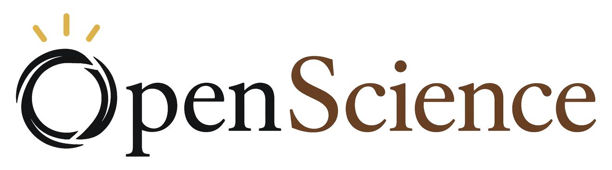
</p>

<p align="center">
  <strong>The open-source workspace for AI-assisted, evidence-backed research across disciplines.</strong>
</p>

<p align="center">
  Start a research project, search evidence, run analysis, generate figures, reports, notebooks, and manuscripts, and keep every result traceable in your own workspace.
</p>

<p align="center">
  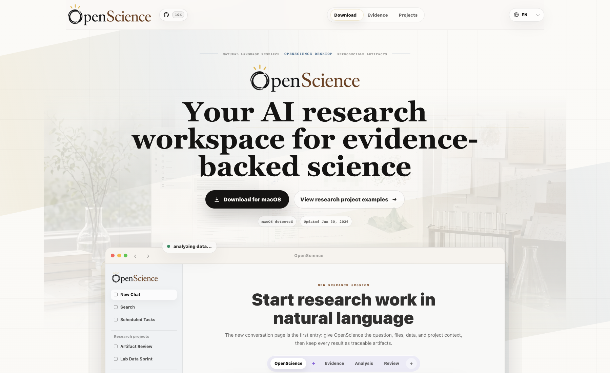
</p>

<p align="center">
  <a href="https://openscience.cc/">Website</a> ·
  <a href="https://github.com/ResearAI/OpenScience/releases">Download</a> ·
  <a href="./docs/specs/science-mode-architecture.zh-CN.md">Science Mode Plan</a> ·
  <a href="./docs/developers.md">Developers</a> ·
  <a href="https://github.com/ResearAI/OpenScience/discussions">Discussions</a>
</p>

<p align="center">
  <a href="https://github.com/ResearAI/OpenScience/releases"></a>
  <a href="LICENSE"></a>
  
  
  
</p>

<p align="center">
  <b>English</b> · <a href="./docs/readme/readme_ch.md">简体中文</a> · <a href="./docs/readme/readme_tw.md">繁體中文</a> · <a href="./docs/readme/readme_jp.md">日本語</a> · <a href="./docs/readme/readme_ko.md">한국어</a> · <a href="./docs/readme/readme_es.md">Español</a> · <a href="./docs/readme/readme_pt.md">Português</a> · <a href="./docs/readme/readme_tr.md">Türkçe</a> · <a href="./docs/readme/readme_ru.md">Русский</a> · <a href="./docs/readme/readme_uk.md">Українська</a>
</p>

---

## What is OpenScience

**Search evidence. Run analysis. Ship reproducible science.** OpenScience is a local-first AI research workspace inspired by the Claude Science product direction, built as an open-source desktop app. It is not another chat box. It is a place where a scientist can open a research project, ask a question, search evidence, run code, inspect files, revise outputs, and export the work with a source trail.

The same workspace should make sense to a wet-lab biologist checking a gene list, a clinician comparing guidelines, a chemist reviewing molecules, an engineer reading simulation logs, a social scientist auditing a replication package, or an ML researcher turning experiments into figures. The important part is the same: the answer should stay connected to the evidence, files, code, and decisions that produced it.

It combines **Science Mode** for general research with a stricter **Medical Evidence Mode** for clinical and biomedical questions. The evidence layer is designed to search and analyze **11M+ papers**, **225K+ drug and device documents**, **1M+ clinical trials**, and **150M+ research abstracts**, while also keeping local files, code runs, figures, tables, notebooks, and reviewer notes connected to the final result.

> Not a single answer. A durable research record: evidence, code, figures, notebooks, manuscripts, and every step needed to reproduce, review, and defend the result.

## Capability map

OpenScience is a full research workspace, not a single-purpose assistant. Science Mode currently includes **352 default scientific skills** across **10+ research directions**, with working paths for evidence search, local analysis, project memory, review, and export.

<p align="center">
  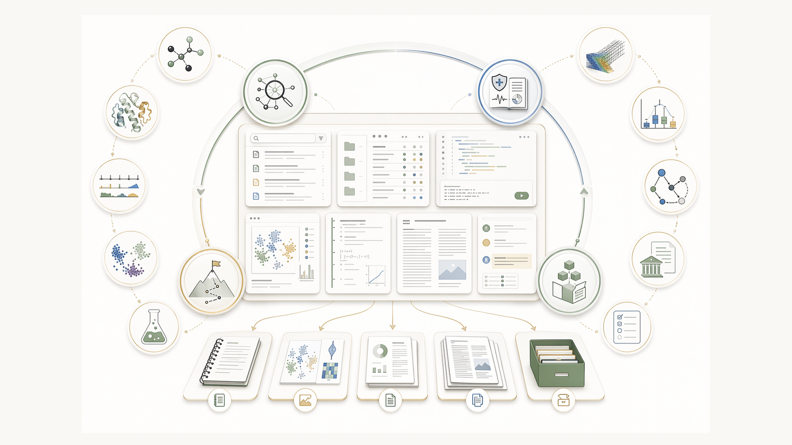
</p>

| Layer                | What OpenScience covers                                                                                                                                                    |
| -------------------- | -------------------------------------------------------------------------------------------------------------------------------------------------------------------------- |
| Research modes       | Science Mode, Medical Evidence Mode, Goal Mode, Knowledge Distillation Mode                                                                                                |
| Disciplines          | life sciences, chemistry, drug discovery, structural biology, genomics, single-cell, engineering computation, data science, social science, econometrics, causal inference |
| Evidence sources     | PubMed, ChEMBL, GEO, AlphaFold, and routed access to 20+ scientific database families                                                                                      |
| Outputs              | evidence reports, figures, tables, notebooks, manuscripts, code logs, project records                                                                                      |
| Local-first workflow | local files, local agents, local project folders, optional model/provider configuration                                                                                    |

| Core idea                          | What the user gets                                                                                        |
| ---------------------------------- | --------------------------------------------------------------------------------------------------------- |
| Research projects, not loose chats | A folder-backed workspace for sources, data, scripts, outputs, comments, and exports                      |
| Evidence first                     | Claims can point back to papers, trials, regulatory documents, datasets, code, or generated results       |
| Run the analysis                   | Python, R, shell, notebooks, and existing project pipelines stay inside the same workflow                 |
| Results you can reopen             | Figures, tables, reports, manuscripts, and notebooks keep code, inputs, logs, and review notes attached   |
| Knowledge becomes reusable         | A useful conversation, SOP, figure style, review routine, or lab protocol can become a local custom skill |
| Local-first by default             | Files stay close to the laptop, lab machine, workstation, or approved infrastructure                      |

---

## Across research fields

OpenScience is built around research objects rather than one narrow domain. The first version focuses on the project workspace, evidence reports, result previews, local code runs, exports, and reusable skills; discipline-specific viewers and remote compute are being added on top of that foundation.

| Field                                 | Language OpenScience should understand                                                       | Useful outputs                                                                       |
| ------------------------------------- | -------------------------------------------------------------------------------------------- | ------------------------------------------------------------------------------------ |
| Biomedical evidence                   | guideline, RCT, cohort, label, contraindication, endpoint, subgroup, GRADE, FDA/EMA document | evidence report, source table, recommendation summary, conflict and limitation notes |
| Single-cell and genomics              | scRNA-seq, AnnData, UMAP, marker genes, batch effect, FASTQ/BAM/VCF, GEO, Ensembl            | analysis notebook, QC table, marker list, figure panels, methods text                |
| Protein and structural biology        | FASTA, PDB/mmCIF, AlphaFold, domain, binding pocket, alignment, mutation                     | structure notes, sequence table, model comparison, figure-ready panels               |
| Chemistry and drug discovery          | SMILES, SDF, ChEMBL, assay, docking, ADMET, scaffold, SAR                                    | molecule table, assay summary, docking report, chemistry rationale                   |
| Ecology and phylogeny                 | species tree, trait matrix, sequence alignment, habitat covariates, bootstrap                | tree figure, alignment notes, dataset audit, reproducible script                     |
| Engineering and simulation            | mesh, solver, boundary condition, sweep, residual, CFD/FEA, sensor log                       | parameter table, run log, plots, technical report                                    |
| Social science and empirical research | survey, codebook, panel data, DiD, IV, RDD, robustness, replication package                  | model table, robustness appendix, codebook notes, replication report                 |
| AI, ML, and systems                   | baseline, ablation, benchmark, seed, GPU run, latency, error analysis                        | experiment table, leaderboard, plots, paper-ready result summary                     |

---

## What you see in the app

A quick look at the OpenScience experience: start from **Research Projects**, move into a research result panel, use **Medical Evidence Mode** when evidence discipline matters, and scale toward local or remote compute without leaving the project.

| Step | What you do                                                            | What OpenScience keeps                                             |
| ---: | ---------------------------------------------------------------------- | ------------------------------------------------------------------ |
|    1 | Create or reopen a research project                                    | project folder, settings, sources, outputs                         |
|    2 | Choose Science, Medical Evidence, Goal, or Knowledge Distillation Mode | the right working rules for the task and the context               |
|    3 | Ask a natural-language research question                               | task, assumptions, files, clarifying answers                       |
|    4 | Search evidence or run code                                            | source labels, scripts, commands, notebooks, logs                  |
|    5 | Open the result panel                                                  | figure, table, report, manuscript, source trail, review state      |
|    6 | Revise and export                                                      | new versions, comments, PDF, Word, LaTeX, notebook, project record |

### Result studio — many scientific outputs in one project

Inside a research project, the same conversation can produce multiple result types and keep the work as a reusable, traceable research record:

<table>
<tr>
<td width="50%" valign="top">
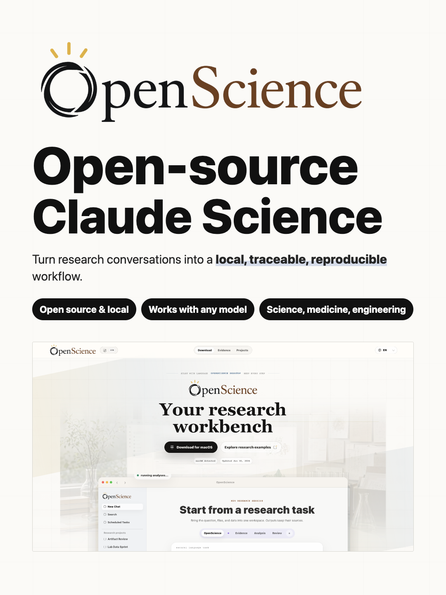<br/>
<sub><b>Open-source Claude Science</b> — open-source, local-first research workflows that support any model and many scientific disciplines.</sub>
</td>
<td width="50%" valign="top">
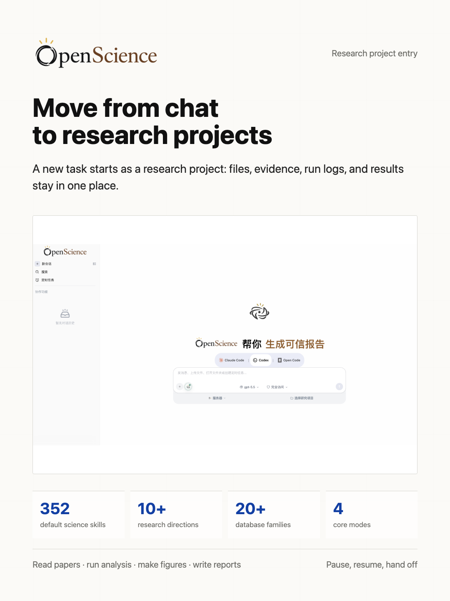<br/>
<sub><b>Research projects</b> — start from a project, not a disposable chat, so files, runs, evidence, and results stay together.</sub>
</td>
</tr>
<tr>
<td width="50%" valign="top">
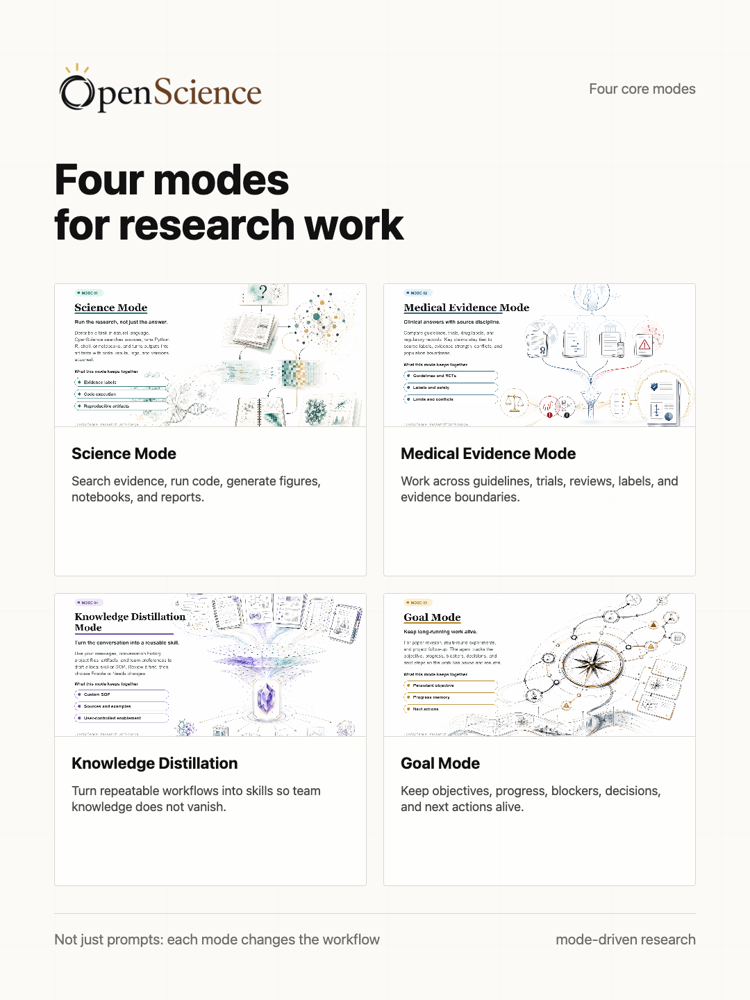<br/>
<sub><b>Four work modes</b> — Science Mode, Medical Evidence Mode, Knowledge Distillation Mode, and Goal Mode for different research situations.</sub>
</td>
<td width="50%" valign="top">
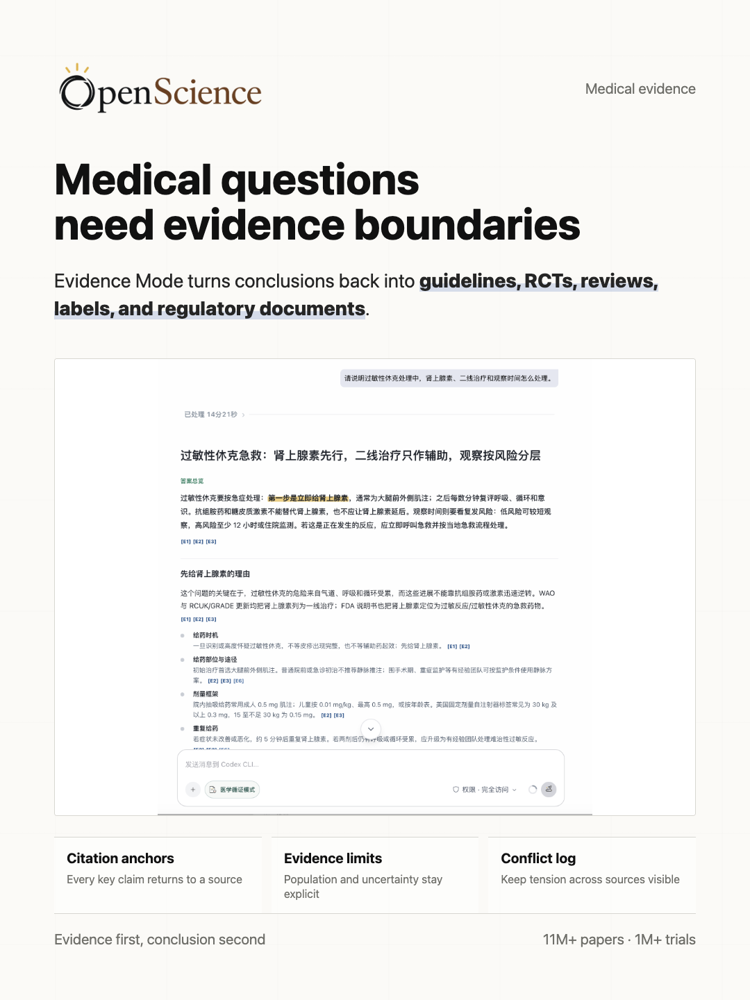<br/>
<sub><b>Medical evidence</b> — organize clinical and biomedical answers around citations, evidence boundaries, conflicts, and traceable references.</sub>
</td>
</tr>
<tr>
<td width="50%" valign="top">
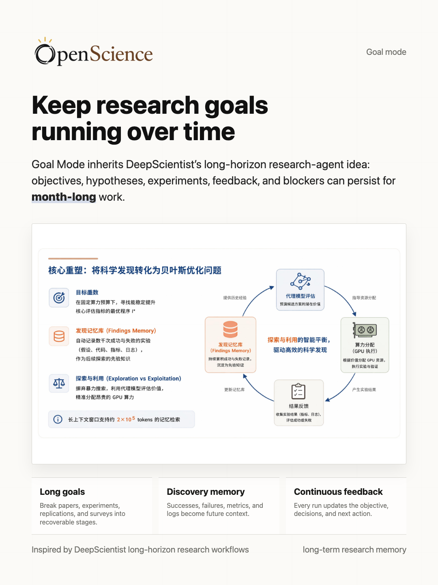<br/>
<sub><b>Goal mode</b> — sustain long-running research goals with progress, blockers, decisions, and next actions.</sub>
</td>
<td width="50%" valign="top">
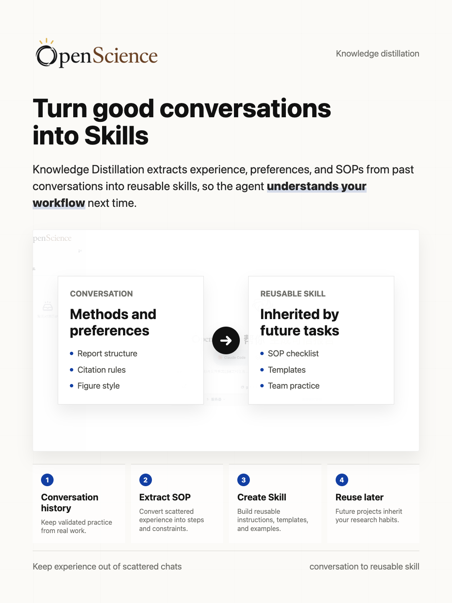<br/>
<sub><b>Knowledge distillation</b> — turn successful conversations, SOPs, and project context into reusable local skills.</sub>
</td>
</tr>
<tr>
<td width="50%" valign="top">
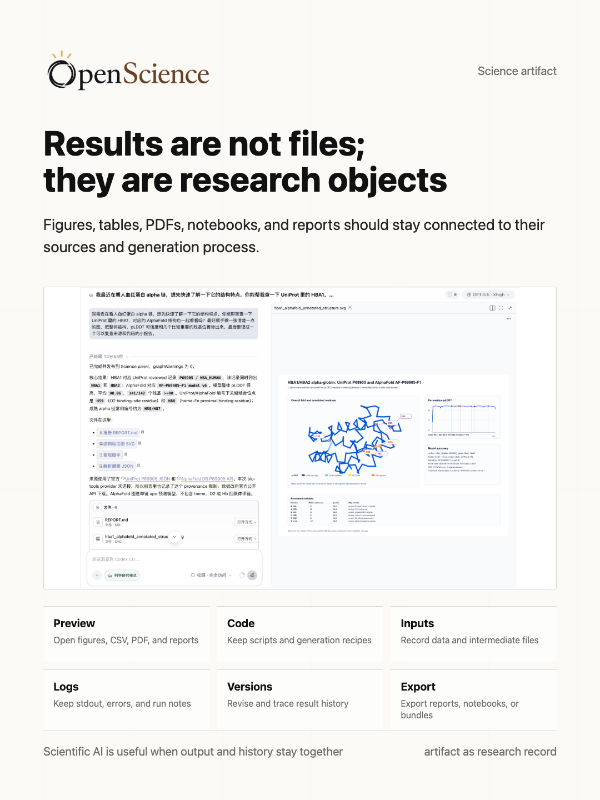<br/>
<sub><b>Science artifacts</b> — outputs are not attachments; they keep previews, code, inputs, logs, versions, and export paths.</sub>
</td>
<td width="50%" valign="top">
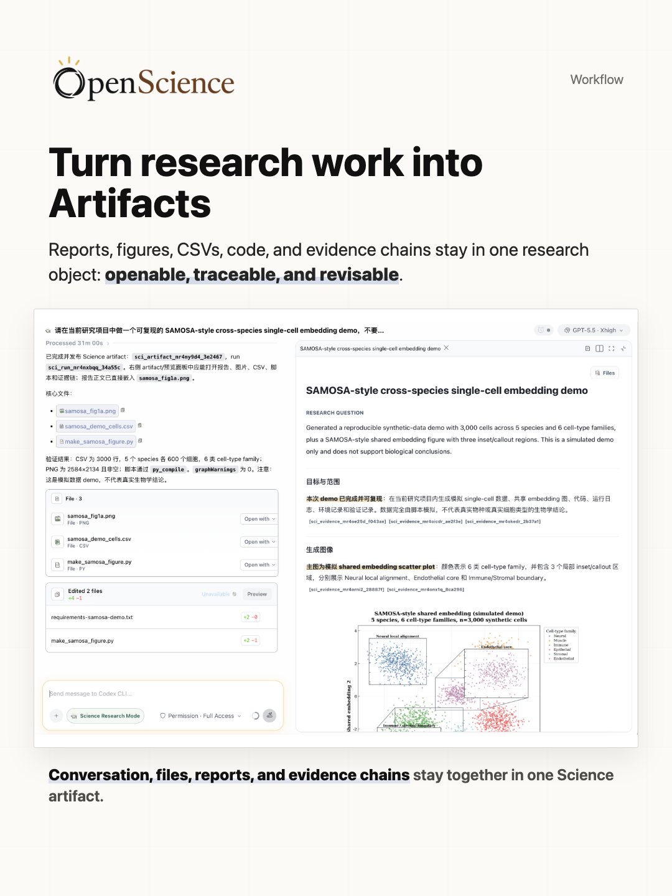<br/>
<sub><b>Result studio</b> — conversations, files, reports, and evidence chains land in one Science artifact.</sub>
</td>
</tr>
</table>

---

## Four ways to work

OpenScience modes are not just different prompt templates. They change the working rules: whether the agent should bind the task to a research project, search evidence, create a traceable result, keep a long-running goal alive, or turn a useful workflow into a reusable skill.

| Mode                            | Use it when                                                                                                            | What you should get                                                                                      |
| ------------------------------- | ---------------------------------------------------------------------------------------------------------------------- | -------------------------------------------------------------------------------------------------------- |
| **Science Mode**                | You need literature review, data analysis, computational experiments, figures, notebooks, or a manuscript draft        | A research result with sources, code, inputs, logs, versions, and export options                         |
| **Medical Evidence Mode**       | You need a disciplined clinical, biomedical, guideline, trial, label, or regulatory evidence answer                    | A structured evidence report with source labels, strength, conflicts, limits, and conclusion             |
| **Goal Mode**                   | The task will take multiple rounds, such as paper revision, long experiments, project planning, or continuing analysis | A persistent goal with progress, next steps, blockers, and recoverable context                           |
| **Knowledge Distillation Mode** | Your messages and conversation history already describe a reusable way of working                                      | A custom skill draft with SOP, references, examples, privacy notes, conflicts, and enable/modify choices |

<table>
<tr>
<td width="50%" valign="top">
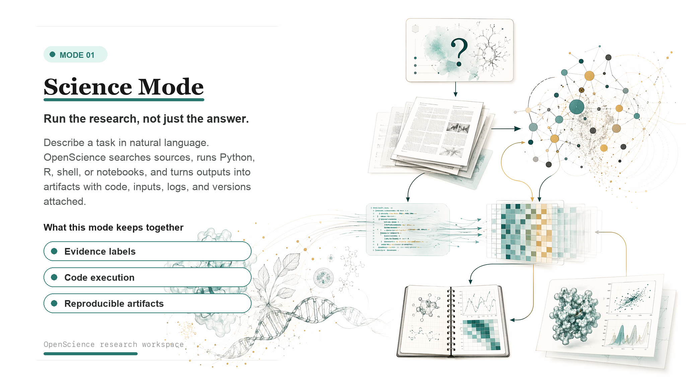<br/>
<sub><b>Science Mode</b> — search sources, run code, and keep figures, notebooks, reports, logs, and versions together.</sub>
</td>
<td width="50%" valign="top">
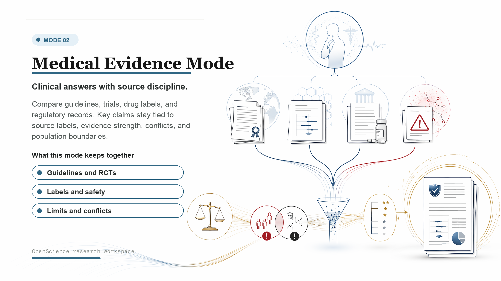<br/>
<sub><b>Medical Evidence Mode</b> — compare guidelines, trials, labels, and safety boundaries before writing a clinical evidence answer.</sub>
</td>
</tr>
<tr>
<td width="50%" valign="top">
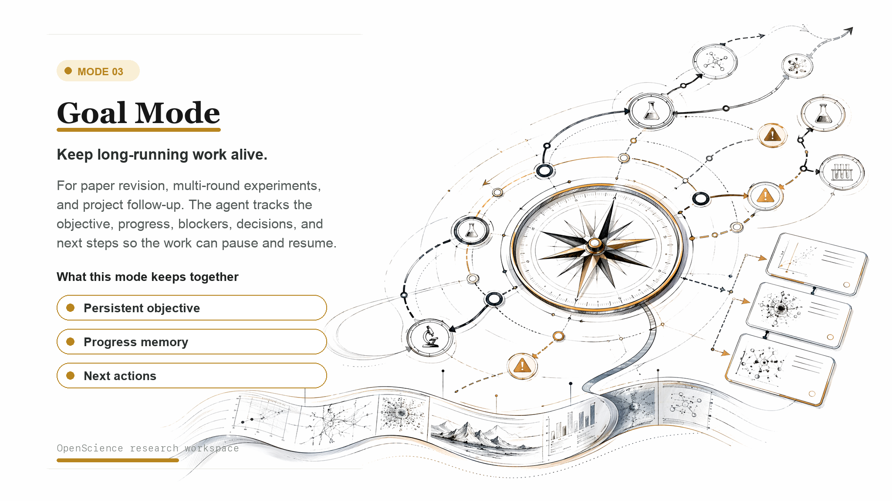<br/>
<sub><b>Goal Mode</b> — preserve the objective, progress, blockers, decisions, and next actions across long-running work.</sub>
</td>
<td width="50%" valign="top">
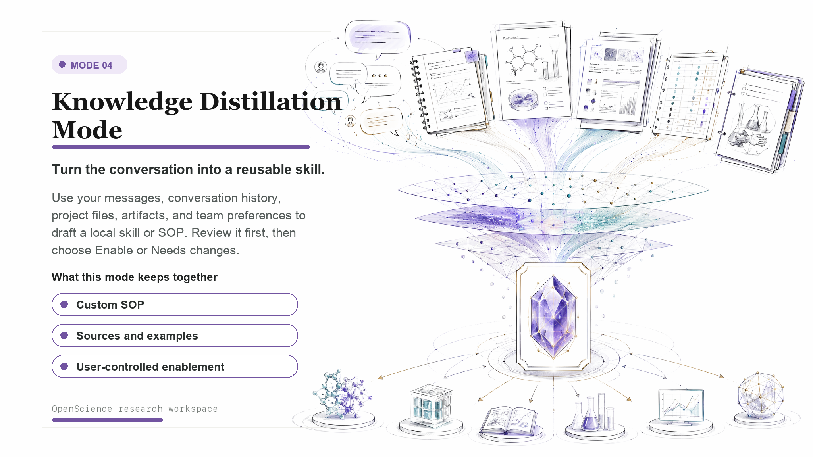<br/>
<sub><b>Knowledge Distillation Mode</b> — turn a useful conversation, protocol, or team preference into a reviewable local skill.</sub>
</td>
</tr>
</table>

Science Mode is the default research workspace. It is for tasks such as "analyze this dataset", "recreate this figure", "compare these methods", or "turn these results into a manuscript draft". The important point is that the answer should become a reopenable artifact with code, inputs, logs, source labels, versions, and export targets.

Medical Evidence Mode is stricter about source discipline. It should separate guidelines, randomized trials, systematic reviews, drug labels, regulatory documents, and population limits, then show where the evidence agrees, where it conflicts, and where human clinical judgment is still required.

Goal Mode is for work that should survive more than one chat turn. It keeps the objective, progress, blockers, decisions, and next actions visible so a paper revision, experiment campaign, or project follow-up can pause and resume without being reconstructed from scattered messages.

Knowledge Distillation Mode is designed for the moment when a good conversation should become a durable capability. The agent can read the user's instruction, the current conversation history, selected project files, generated artifacts, and follow-up notes, then produce a reviewable skill instead of only a summary. The draft should explain when to use the skill, what steps to follow, what evidence or protocol it came from, what examples matter, what must stay private, and what still needs human confirmation.

Typical uses include:

| What happened in the conversation                    | What OpenScience can distill                                               |
| ---------------------------------------------------- | -------------------------------------------------------------------------- |
| You explained how your lab cleans a dataset          | a reusable data-cleaning SOP with checks and failure cases                 |
| You iterated a figure until it matched the lab style | a figure-polish skill with style rules, templates, and export requirements |
| You handled a reviewer comment well                  | a reviewer-response skill with evidence rules and tone constraints         |
| You described a wet-lab or computational protocol    | a protocol skill with inputs, steps, quality gates, and safety notes       |
| You built a useful literature-review route           | a search-and-screening skill with source priorities and exclusion rules    |

The generated skill is not enabled silently. OpenScience should show it as a report first, then let the user choose **Enable** or **Needs changes**. That keeps skill creation customized, inspectable, and under the user's control.

---

## Evidence and source trail

OpenScience's evidence story is simple: a result should never be just text. It should point to the material behind it.

<p align="center">
  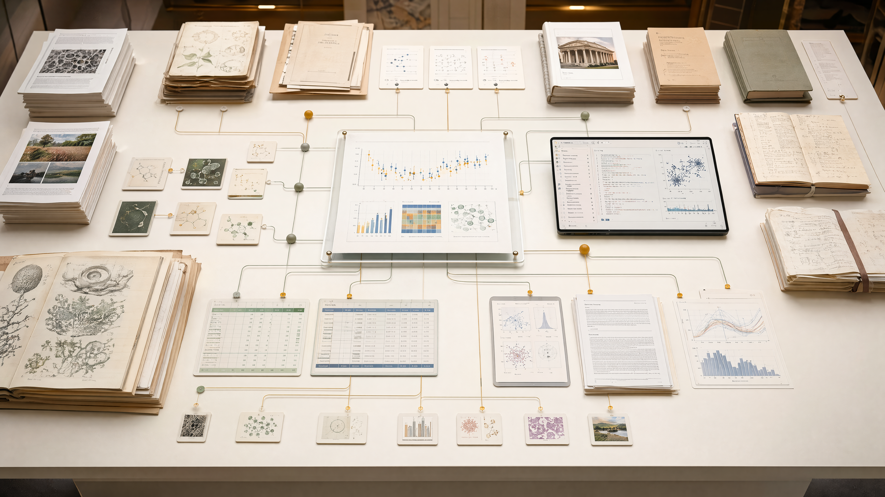
</p>

| Search and analyze                    | Designed for                                                          |
| ------------------------------------- | --------------------------------------------------------------------- |
| **11M+ papers**                       | literature review, methods comparison, citation-backed writing        |
| **225K+ drug and device documents**   | labels, safety context, indications, guidance, regulatory review      |
| **1M+ clinical trials**               | interventions, outcomes, enrollment, status, comparators, eligibility |
| **150M+ abstracts**                   | fast discovery before deep reading                                    |
| **Local files and generated outputs** | PDFs, datasets, scripts, figures, notebooks, logs, reports, comments  |

| Research object          | Examples OpenScience should keep connected                                       |
| ------------------------ | -------------------------------------------------------------------------------- |
| Paper or clinical source | PMID, DOI, guideline section, trial record, FDA label, abstract, uploaded PDF    |
| Dataset or table         | CSV/TSV, AnnData metadata, assay table, survey codebook, simulation parameters   |
| Biological object        | gene list, marker table, FASTA sequence, PDB/mmCIF structure, alignment          |
| Chemical object          | SMILES, SDF, scaffold, assay result, docking score, ADMET filter                 |
| Code and run record      | script, notebook cell, shell command, environment note, run log, exported figure |

| Source label     | Can point to                                                             |
| ---------------- | ------------------------------------------------------------------------ |
| `E1`, `E2`, `E3` | papers, trials, regulatory records, guidelines, abstracts, uploaded PDFs |
| `D1`, `D2`, `D3` | datasets, CSV rows, local files, exported tables, intermediate artifacts |
| `C1`, `C2`, `C3` | scripts, notebook cells, shell commands, model outputs, run logs         |
| `R1`, `R2`, `R3` | reviewer notes, human comments, uncertainty checks, unresolved risks     |

---

## Artifacts: results you can reopen

A scientific artifact is not just a file attachment. It is a result object you can reopen: the rendered figure or report stays next to the code, input files, logs, environment notes, conversation, review status, and export targets that produced it. OpenScience builds around that loop because scientific AI becomes useful only when the output and its history stay together.

| Artifact        | What stays attached                                               | Export target              |
| --------------- | ----------------------------------------------------------------- | -------------------------- |
| Figure          | plotting code, input data, source labels, comments, review status | PNG, SVG, PDF              |
| Table           | source rows, filters, transformations, evidence labels            | CSV, XLSX, Markdown        |
| Notebook        | cells, variables, generated files, environment notes              | IPYNB, HTML, PDF           |
| Evidence report | findings, citations, study strength, conflicts, limitations       | Markdown, PDF, Word        |
| Manuscript      | sections, citations, figures, tables, build notes                 | Markdown, LaTeX, DOCX, PDF |
| Project record  | sources, commands, outputs, versions, reviewer notes              | local folder or archive    |

| Artifact panel | Why it matters                                                                                                 |
| -------------- | -------------------------------------------------------------------------------------------------------------- |
| Preview        | Inspect the figure, table, PDF, notebook, Markdown report, manuscript, or generated file in the same workspace |
| Code           | See or download the script, notebook cell, shell command, or generation recipe behind the result               |
| Inputs         | Open the datasets, source documents, configuration files, or previous artifacts used to produce the result     |
| Execution log  | Check what ran, what failed, what changed, and which files were written                                        |
| Environment    | Record package, kernel, model, machine, or agent notes needed to rerun the work                                |
| Messages       | Keep the task request, clarifications, edits, and agent reasoning trail close to the result                    |
| Review         | Track warnings, unresolved questions, source mismatches, and human comments                                    |

| Natural-language revision                | What should happen                                                                                  |
| ---------------------------------------- | --------------------------------------------------------------------------------------------------- |
| "Circle this label and make it readable" | Send the selected region and comment back to the agent, revise plotting code, regenerate the figure |
| "Where did this number come from?"       | Open the source label, table row, notebook cell, command log, or reviewer note behind it            |
| "Make this publication-ready"            | Update the code or manuscript source, not only the rendered image                                   |
| "Export for collaborators"               | Keep the artifact plus evidence trail together, then export the deliverable                         |

---

## Platform Compatibility

OpenScience is an app around models, coding agents, local files, evidence workflows, and research outputs. Bring the tools you already use.

| Layer              | Supported or planned direction                                                                                                 |
| ------------------ | ------------------------------------------------------------------------------------------------------------------------------ |
| Desktop            | macOS, Windows, Linux                                                                                                          |
| Models             | OpenAI, Anthropic, Gemini, Bedrock, Ollama, LM Studio, local and OpenAI-compatible endpoints                                   |
| Coding agents      | Built-in assistant, Claude Code, Codex, Qwen Code, Kimi, OpenCode, Cursor, Hermes, and similar local CLIs                      |
| Files              | PDF, CSV, TSV, images, Markdown, LaTeX-oriented projects, notebooks, Word, Excel, PowerPoint                                   |
| Scientific preview | Figures, tables, PDFs, manuscripts today; molecules, proteins, genome tracks, alignments, and structures as Science Mode grows |
| Compute            | Local laptop today; SSH, Slurm, cloud VM, GPU job tracking, and persistent Python/R kernels as the compute layer matures       |

---

## Why OpenScience

> Claude Science shows where scientific AI is going: not only answering questions, but running analyses, searching databases, producing research results, and preserving the source trail. OpenScience takes that direction into an open-source, local-first desktop workspace.

|                                  | General AI chat | Claude Science         | **OpenScience**                                                            |
| -------------------------------- | --------------- | ---------------------- | -------------------------------------------------------------------------- |
| Open source                      | No              | No                     | **Yes, AGPL-3.0-only**                                                     |
| Local project folder             | Sometimes       | Yes                    | **Yes, local-first**                                                       |
| Evidence-labeled medical reports | Usually manual  | General science review | **First-class Medical Evidence Mode**                                      |
| Run code and inspect files       | Tool-dependent  | Yes                    | **Yes, through local coding workflows**                                    |
| Results with source trails       | Rare            | Yes                    | **Designed around result history**                                         |
| Model choice                     | Often fixed     | Anthropic models       | **Multi-provider and local endpoint support**                              |
| Existing lab workflows           | Manual glue     | Connectors and compute | **Designed for local scripts, project folders, and future remote compute** |

---

## Quick start

### Option 1: install the desktop app

The fastest path is the packaged app from [GitHub Releases](https://github.com/ResearAI/OpenScience/releases). Choose the file that matches your computer:

| System              | Download                    |
| ------------------- | --------------------------- |
| macOS Apple Silicon | `OpenScience-*-arm64.dmg`   |
| macOS Intel         | `OpenScience-*-x64.dmg`     |
| Windows             | `OpenScience-*-x64.exe`     |
| Linux               | `OpenScience-*-linux-*.deb` |

After installation, open OpenScience. No app-level login is required: the app opens directly to the home page. The desktop app also starts a local WebUI by default, so the same workspace can be opened from a browser on this computer from **Settings -> Remote Connection -> WebUI**. Create or reopen a research project, then start with **Science Mode**, **Medical Evidence Mode**, **Goal Mode**, or **Knowledge Distillation Mode**.

Before the first real agent run, open **Settings** and configure at least one model provider, local model endpoint, or coding agent such as Claude Code, Codex, Qwen Code, or another supported local CLI. If a packaged release is not available yet, use the source workflow below.

On Linux, the release package is a Debian package:

```bash
sudo apt install ./OpenScience-*-linux-*.deb
OpenScience
```

For a browser-only or headless Linux session, start WebUI explicitly. Local-only access is enough on a workstation; add `--remote` only when you want to reach it from another device or through an SSH tunnel:

```bash
# Local browser on the same machine.
OpenScience --webui --port 25808

# Server / LAN access.
OpenScience --webui --remote --port 25808
```

Open `http://localhost:25808` for local access, or `http://<server-ip>:25808` when remote access is enabled and your firewall allows the port.

### Option 2: run from source

```bash
git clone https://github.com/ResearAI/OpenScience.git
cd OpenScience
bun install --frozen-lockfile
bun run start
```

You need Git and Bun. If Bun is not installed, follow <https://bun.sh/docs/installation>, then rerun the commands above.

If you plan to run Playwright browser tests or standalone screenshot automation, install the pinned Playwright browser bundle explicitly:

```bash
bun run playwright:install
```

OpenScience's Electron tests and app preview panes can run without this extra download. The copied Playwright MCP configuration connects to the app's local Chrome DevTools endpoint instead of launching its own browser.

When the desktop app is running, WebUI is available by default from the app's WebUI settings. For a clean browser/WebUI development run that does not reuse your desktop data directory:

```bash
DEEPORGANISER_DATA_DIR=/tmp/openscience-webui-clean bun run webui -- --port 25809
```

For a Linux server or container where no Electron window is needed, use:

```bash
DEEPORGANISER_DATA_DIR=/var/lib/openscience-webui bun run webui:remote -- --port 25809
```

Then open `http://localhost:25809` locally, or forward the port with SSH:

```bash
ssh -L 25809:127.0.0.1:25809 user@your-linux-host
```

The WebUI startup path automatically syncs the bundled OpenScience skills and built-in MCP catalog. You should not run `bun run skills:science:materialize` during a normal install; that script is for maintainers regenerating the vendored science skill pack.

Before the first real Science or Medical Evidence task, install and sign in to at least one local coding agent, such as Codex CLI (`codex`), Claude Code (`claude`), or OpenCode (`opencode`). OpenScience can start without them, but research execution depends on one of these agent backends or a configured model/provider.

### Build installers from source

OpenScience uses `electron-vite` for the desktop bundles and `electron-builder` for installable packages. Use Node.js 22+, Bun, Git, and the platform build tools for the operating system you are packaging on.

```bash
git clone https://github.com/ResearAI/OpenScience.git
cd OpenScience
bun install --frozen-lockfile
```

Common build commands:

| Target              | Command                   | Output                                       |
| ------------------- | ------------------------- | -------------------------------------------- |
| macOS Apple Silicon | `bun run build-mac:arm64` | `out/OpenScience-*-mac-arm64.dmg` and `.zip` |
| macOS Intel         | `bun run build-mac:x64`   | `out/OpenScience-*-mac-x64.dmg` and `.zip`   |
| macOS both archs    | `bun run build-mac`       | arm64 + x64 macOS packages                   |
| Windows x64         | `bun run build-win:x64`   | `out/OpenScience-*-win-x64.exe` and `.zip`   |
| Windows ARM64       | `bun run build-win:arm64` | `out/OpenScience-*-win-arm64.exe` and `.zip` |
| Linux current arch  | `bun run build-deb`       | `out/OpenScience-*-linux-*.deb`              |

The packaged desktop app must include the matching OpenScience Core runtime. The build script downloads the pinned runtime version from the `deepOrganiserCoreVersion` field in `package.json` and places it under `resources/bundled-deeporganiser-core/<platform>-<arch>/`. For private or rate-limited GitHub downloads, set `GH_TOKEN` or `GITHUB_TOKEN`.

For release-quality packages, build on the native platform or use the GitHub Actions manual build workflow:

| Platform       | Recommended build host                             |
| -------------- | -------------------------------------------------- |
| macOS `.dmg`   | macOS runner or Mac hardware                       |
| Windows `.exe` | Windows runner with Visual Studio 2022 Build Tools |
| Linux `.deb`   | Ubuntu runner or compatible Linux host             |

macOS signing/notarization is optional for local testing, but release builds should provide Apple signing credentials. Windows builds require the MSVC toolchain for native dependencies. Linux builds require standard Debian packaging and GTK/Electron dependencies.

### Ask Claude Code or Codex to install it for you

If you are not comfortable with terminal setup, paste this prompt into Claude Code, Codex, or another local coding agent:

```text
Please install and run OpenScience on this computer. The repository is https://github.com/ResearAI/OpenScience. First check whether git, bun, and at least one local coding agent such as Codex CLI, Claude Code, or OpenCode are available. If something is missing, tell me exactly what to install. Then clone the repository, run `bun install --frozen-lockfile`, and start the desktop app with `bun run start`. The desktop app should expose WebUI by default through Settings -> Remote Connection -> WebUI. For a clean browser run, use `DEEPORGANISER_DATA_DIR=/tmp/openscience-webui-clean bun run webui -- --port 25809`; on a Linux server use `DEEPORGANISER_DATA_DIR=/var/lib/openscience-webui bun run webui:remote -- --port 25809` and, if needed, forward the port with `ssh -L 25809:127.0.0.1:25809 user@host`. Do not run `bun run skills:science:materialize` unless I am maintaining the vendored skill pack. Do not delete or overwrite any existing personal files. If there are dependency, permission, port, Electron, or native-module problems, diagnose them step by step and fix them when safe. When OpenScience starts successfully, tell me that it opens without an app-level login, then show me where to configure model/API keys or local coding agents in Settings.
```

### A full workflow — from question to artifact

`project → question → evidence → analysis → artifact → review → export`

1. Create or reopen a research project.
2. Ask a scientific, clinical, computational, or writing question.
3. Search evidence and attach readable source labels.
4. Run Python, R, shell, notebooks, or existing project scripts.
5. Open the generated figure, table, report, notebook, or manuscript in the preview panel.
6. Revise by natural language, comments, or file edits.
7. Export the artifact with its source trail.

---

## Example outcomes

<p align="center">
  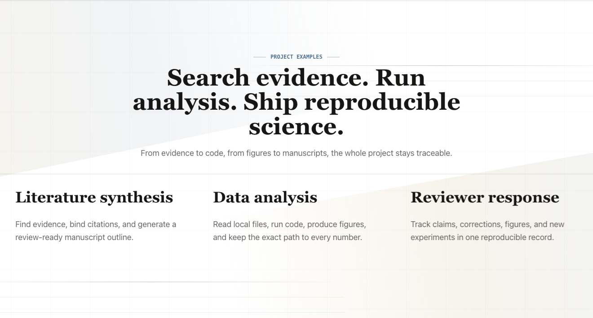
</p>

| You start with                                                | OpenScience should help produce                                                                             |
| ------------------------------------------------------------- | ----------------------------------------------------------------------------------------------------------- |
| "Compare these single-cell integration methods on my dataset" | notebook, benchmark table, UMAP panels, method notes, rerunnable commands                                   |
| "Which evidence supports this clinical treatment claim?"      | medical evidence report with guidelines, trials, labels, contraindications, conflicts, and confidence notes |
| "Summarize these AlphaFold models and mutations"              | sequence and structure notes, comparison table, figure panels, caveats, source links                        |
| "Screen these compounds against assay and ADMET constraints"  | molecule table, filter rationale, assay summary, exported CSV, review notes                                 |
| "Reproduce this economics paper's main table"                 | replication log, cleaned dataset notes, model table, robustness appendix, code references                   |
| "Turn this CFD parameter sweep into a report"                 | run summary, plots, parameter table, solver logs, PDF or Markdown report                                    |
| "Make this figure publication-ready"                          | regenerated figure, plotting script, input table, style notes, export files                                 |
| "Turn this analysis into a manuscript section"                | Markdown or LaTeX-oriented text with citations, figures, limitations, source labels                         |
| "Review this result before I share it"                        | checklist of numbers, claims, sources, code-output consistency, and unresolved risks                        |

---

## Roadmap

| Area                                                                                                 | Status                  |
| ---------------------------------------------------------------------------------------------------- | ----------------------- |
| Desktop app and local preview system                                                                 | Available               |
| Multi-model and coding-agent support                                                                 | Available               |
| Medical Evidence Mode                                                                                | Available and improving |
| Science Mode project entry                                                                           | In progress             |
| Artifact preview with source-trail tabs                                                              | In progress             |
| Figure annotation and code-level regeneration                                                        | In progress             |
| Notebook, PDF, manuscript, and document export polish                                                | In progress             |
| Molecule, protein, genome track, alignment, social-science model/codebook/map, and structure viewers | Planned                 |
| SSH, Slurm, cloud VM, GPU job tracking, persistent Python/R kernels                                  | Planned                 |
| Background reviewer checks for citations, numbers, figures, and code-output match                    | Planned                 |

---

## Community

OpenScience is for researchers, clinicians, students, engineers, and builders who want scientific AI to be inspectable rather than mysterious.

| You are               | OpenScience should help you                                  |
| --------------------- | ------------------------------------------------------------ |
| Researcher            | Move from question to evidence, analysis, figure, and draft  |
| Clinician or reviewer | Separate strong evidence from weak or conflicting evidence   |
| Student               | Learn how a result was produced, not just what the answer is |
| Data scientist        | Keep code, files, figures, and reports in one place          |
| Lab lead              | Reuse good workflows and review source trails                |

Use [Discussions](https://github.com/ResearAI/OpenScience/discussions) for ideas, workflows, feature requests, and research examples.

---

## References & lineage

| Reference                                                                                              | What OpenScience learns from it                                                                                                                                                               |
| ------------------------------------------------------------------------------------------------------ | --------------------------------------------------------------------------------------------------------------------------------------------------------------------------------------------- |
| [Claude Science](https://claude.com/product/claude-science)                                            | Research projects, scientific artifacts, native scientific previews, compute integration, domain tools, and reviewer checks                                                                   |
| [OpenScience download page](https://openscience.cc/)                                                   | Public-facing wording and visual rhythm: natural-language research, reproducible artifacts, evidence coverage, and desktop download                                                           |
| [nexu-io/open-design](https://github.com/nexu-io/open-design)                                          | README structure, visual storytelling, product-tour layout, and open-source launch style                                                                                                      |
| [AionUi](https://github.com/iOfficeAI/AionUi)                                                          | The original open-source desktop AI assistant foundation that this fork builds on                                                                                                             |
| [DeepScientist](https://github.com/ResearAI/DeepScientist)                                             | Research workflows, evidence-first thinking, scientific writing, and analysis routines                                                                                                        |
| [K-Dense scientific-agent-skills](https://github.com/K-Dense-AI/scientific-agent-skills)               | A broad MIT-licensed scientific skill corpus for database lookup, bio/chem workflows, scientific Python packages, writing, and lab integrations                                               |
| [Auto-Empirical Research Skills](https://github.com/brycewang-stanford/Auto-Empirical-Research-Skills) | CC BY-SA 4.0 empirical-research skill corpus for econometrics, causal inference, replication, citation checks, survey/codebook work, qualitative analysis, and social-science paper workflows |
| [README visual source](./resources/readme/source/open-design-style-readme.html)                        | Deterministic, readable product images rendered for this README                                                                                                                               |
| [Download page source](./server/DeepOrganiserServer/public/index.html)                                 | Landing-page screenshots and OpenScience website assets used in README visuals                                                                                                                |
| Open scientific software                                                                               | Results should be inspectable, rerunnable, and reusable                                                                                                                                       |

---

## Developers and Maintainers

OpenScience is developed by WestlakeNLP and Zhongguancun Academy. See the [developer list](./docs/developers.md) for the current development team and contact information.

For research collaboration, long-term internship, PhD, or research assistant opportunities, contact Professor Yue Zhang at `zhangyue@westlake.edu.cn`.

OpenScience inherits part of its long-horizon research workflow design from DeepScientist. If OpenScience or its Science workflows materially help your paper, report, or research project, please also consider citing the DeepScientist paper:

```bibtex
@inproceedings{
weng2026deepscientist,
title={DeepScientist: Advancing Frontier-Pushing Scientific Findings Progressively},
author={Yixuan Weng and Minjun Zhu and Qiujie Xie and QiYao Sun and Zhen Lin and Sifan Liu and Yue Zhang},
booktitle={The Fourteenth International Conference on Learning Representations},
year={2026},
url={https://openreview.net/forum?id=cZFgsLq8Gs}
}
```

For discussion and community updates, you can join the WeChat group below. The QR code may be refreshed periodically.

<p align="center">
  
</p>

---

## License

This project is a modified work based on [AionUi](https://github.com/iOfficeAI/AionUi), originally licensed under Apache-2.0.

Starting from this OpenScience fork/distribution, OpenScience is licensed under [AGPL-3.0-only](./LICENSE), except for third-party components and files that carry their own license notices. Original Apache-2.0 copyright, license, and attribution notices are preserved in [LICENSES/Apache-2.0.txt](./LICENSES/Apache-2.0.txt), [NOTICE](./NOTICE), and [THIRD_PARTY_NOTICES.md](./THIRD_PARTY_NOTICES.md).
