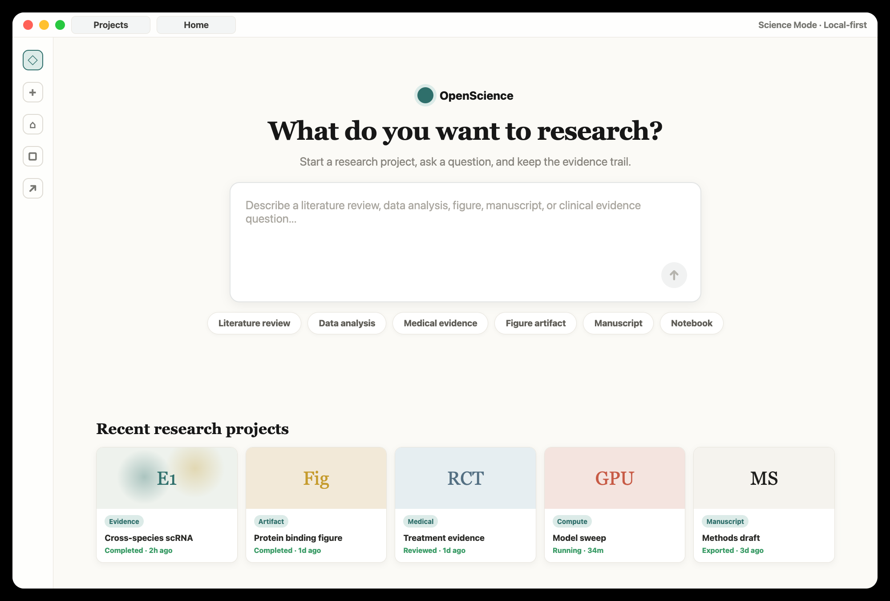
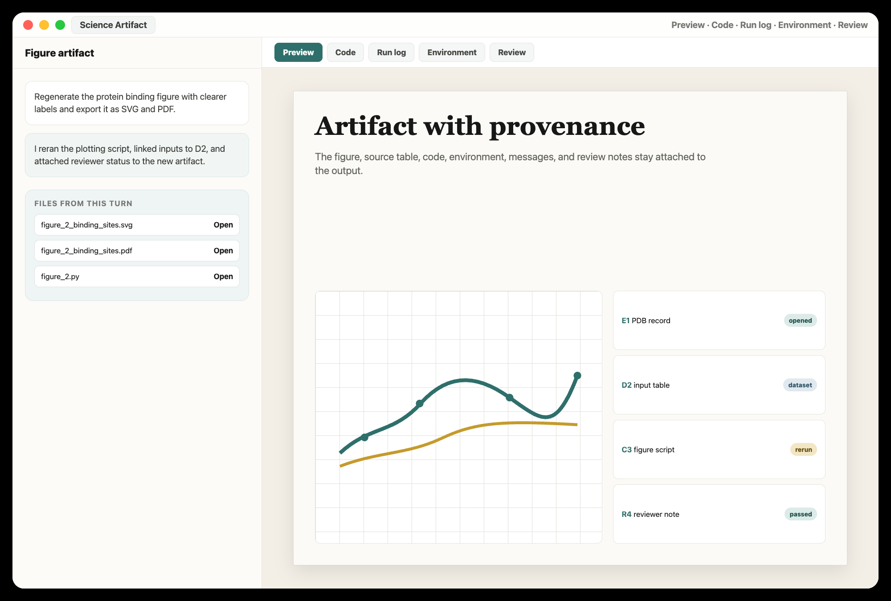
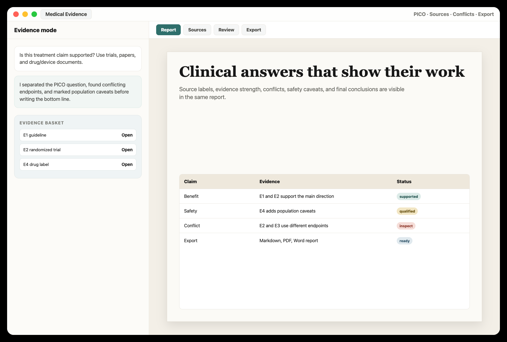
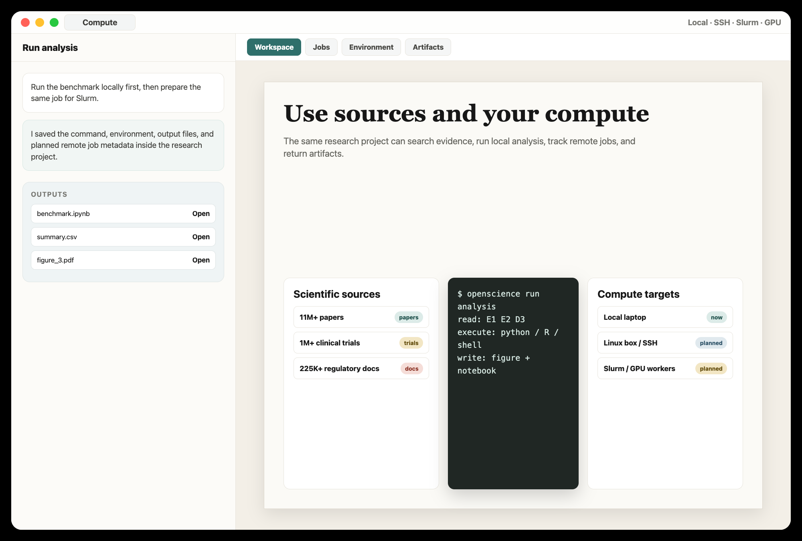
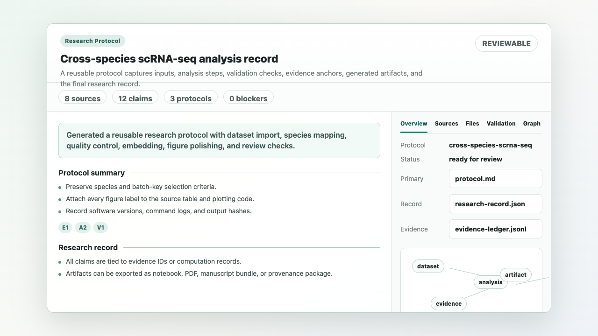

<h1 align="center">OpenScience</h1>

<p align="center">
  <strong>The open-source Science Mode workspace for rigorous, reproducible research.</strong>
</p>

<p align="center">
  Start a research project, search evidence, run analysis, generate artifacts, and keep every scientific result traceable in your own workspace.
</p>

<p align="center">
  
</p>

<p align="center">
  <a href="https://deepscientist.cc/openscience/">Website</a> ·
  <a href="https://github.com/ResearAI/OpenScience/releases">Download</a> ·
  <a href="./docs/specs/science-mode-architecture.zh-CN.md">Science Mode Plan</a> ·
  <a href="./docs/developers.md">Developers</a> ·
  <a href="https://github.com/ResearAI/OpenScience/discussions">Discussions</a>
</p>

<p align="center">
  <a href="https://github.com/ResearAI/OpenScience/releases"></a>
  <a href="LICENSE"></a>
  
  
  
</p>

<p align="center">
  <b>English</b> · <a href="./docs/readme/readme_ch.md">简体中文</a> · <a href="./docs/readme/readme_tw.md">繁體中文</a> · <a href="./docs/readme/readme_jp.md">日本語</a> · <a href="./docs/readme/readme_ko.md">한국어</a> · <a href="./docs/readme/readme_es.md">Español</a> · <a href="./docs/readme/readme_pt.md">Português</a> · <a href="./docs/readme/readme_tr.md">Türkçe</a> · <a href="./docs/readme/readme_ru.md">Русский</a> · <a href="./docs/readme/readme_uk.md">Українська</a>
</p>

---

## What is OpenScience

**Search evidence. Run analysis. Ship reproducible science.** OpenScience is a local-first AI research workspace inspired by the Claude Science product direction, built as an open-source desktop app. It is not another chat box. It is a place where a scientist can open a research project, ask a question, search evidence, run code, inspect files, revise outputs, and export the work with a source trail.

It combines **Science Mode** for general research with a stricter **Medical Evidence Mode** for clinical and biomedical questions. The evidence layer is designed to search and analyze **11M+ papers**, **225K+ drug and device documents**, **1M+ clinical trials**, and **150M+ research abstracts**, while also keeping local files, code runs, figures, tables, notebooks, and reviewer notes connected to the final artifact.

> Not a single answer. A durable research record: evidence, code, figures, notebooks, manuscripts, and every step needed to reproduce, review, and defend the result.

| Core idea | What the user gets |
|---|---|
| Research projects, not loose chats | A folder-backed workspace for sources, data, scripts, outputs, comments, and exports |
| Evidence first | Claims can point back to papers, trials, regulatory documents, datasets, code, or generated results |
| Run the analysis | Python, R, shell, notebooks, and existing project pipelines stay inside the same workflow |
| Artifacts with provenance | Figures, tables, reports, manuscripts, and notebooks keep code, inputs, logs, and review notes attached |
| Local-first by default | Files stay close to the laptop, lab machine, workstation, or approved infrastructure |

---

## Product tour

A quick look at the OpenScience experience: start from **Research Projects**, move into a **Science Artifact** view, use **Medical Evidence Mode** when evidence discipline matters, and scale toward local or remote compute without leaving the project.

### Core pages

<table>
<tr>
<td valign="top">
<br/>
<sub><b>Research projects</b> — start from a study, dataset, figure, manuscript, or clinical question. Recent projects show the state of evidence, artifacts, compute, and writing.</sub>
</td>
</tr>
</table>

<table>
<tr>
<td width="50%" valign="top">
<br/>
<sub><b>Science artifacts</b> — the preview panel becomes a research output workspace: open the figure, inspect code, see inputs, check logs, review provenance, and export.</sub>
</td>
<td width="50%" valign="top">
<br/>
<sub><b>Medical Evidence Mode</b> — clinical and biomedical questions become structured evidence reports with source labels, study strength, regulatory context, conflicts, and conclusions.</sub>
</td>
</tr>
<tr>
<td width="50%" valign="top">
<br/>
<sub><b>Compute and data</b> — keep laptop runs, SSH machines, Slurm jobs, GPU sweeps, project files, and scientific databases attached to the research trail.</sub>
</td>
<td width="50%" valign="top">
<br/>
<sub><b>Native previews</b> — open PDFs, CSVs, images, Markdown, code, diffs, Office files, and generated outputs without leaving the workspace.</sub>
</td>
</tr>
</table>

### Artifact studio — many scientific outputs in one project

Inside a research project, the same conversation can produce multiple artifact types:

<table>
<tr>
<td width="50%" valign="top">
<br/>
<sub><b>Figures and tables</b> — regenerate plots from code, keep input files attached, and export PNG, SVG, PDF, CSV, XLSX, or Markdown.</sub>
</td>
<td width="50%" valign="top">
<br/>
<sub><b>Evidence reports</b> — connect findings to readable source labels, study design, confidence, conflicts, limitations, and final recommendations.</sub>
</td>
</tr>
<tr>
<td width="50%" valign="top">
<br/>
<sub><b>Manuscripts and documents</b> — export Markdown, Word, PDF, LaTeX-oriented drafts, notebooks, spreadsheets, and presentation-ready materials.</sub>
</td>
<td width="50%" valign="top">
<br/>
<sub><b>Reusable research routines</b> — keep repeatable protocols for literature review, evidence review, data analysis, figure polish, reviewer checks, and manuscript drafting.</sub>
</td>
</tr>
</table>

---

## Evidence Engine

OpenScience's evidence story is simple: a result should never be just text. It should point to the material behind it.

<p align="center">
  
</p>

| Search and analyze | Designed for |
|---|---|
| **11M+ papers** | literature review, methods comparison, citation-backed writing |
| **225K+ drug and device documents** | labels, safety context, indications, guidance, regulatory review |
| **1M+ clinical trials** | interventions, outcomes, enrollment, status, comparators, eligibility |
| **150M+ abstracts** | fast discovery before deep reading |
| **Local files and generated outputs** | PDFs, datasets, scripts, figures, notebooks, logs, reports, comments |

| Source label | Can point to |
|---|---|
| `E1`, `E2`, `E3` | papers, trials, regulatory records, guidelines, abstracts, uploaded PDFs |
| `D1`, `D2`, `D3` | datasets, CSV rows, local files, exported tables, intermediate artifacts |
| `C1`, `C2`, `C3` | scripts, notebook cells, shell commands, model outputs, run logs |
| `R1`, `R2`, `R3` | reviewer notes, human comments, uncertainty checks, unresolved risks |

---

## Scientific Artifacts

Claude Science made one product point very clear: scientific AI becomes useful when the output and its history stay together. OpenScience builds around the same artifact-first loop.

| Artifact | What stays attached | Export target |
|---|---|---|
| Figure | plotting code, input data, source labels, comments, review status | PNG, SVG, PDF |
| Table | source rows, filters, transformations, evidence labels | CSV, XLSX, Markdown |
| Notebook | cells, variables, generated files, environment notes | IPYNB, HTML, PDF |
| Evidence report | findings, citations, study strength, conflicts, limitations | Markdown, PDF, Word |
| Manuscript | sections, citations, figures, tables, build notes | Markdown, LaTeX, DOCX, PDF |
| Project record | sources, commands, outputs, versions, reviewer notes | local folder or archive |

| Natural-language revision | What should happen |
|---|---|
| "Circle this label and make it readable" | Send the selected region and comment back to the agent, revise plotting code, regenerate the figure |
| "Where did this number come from?" | Open the source label, table row, notebook cell, command log, or reviewer note behind it |
| "Make this publication-ready" | Update the code or manuscript source, not only the rendered image |
| "Export for collaborators" | Keep the artifact plus evidence trail together, then export the deliverable |

---

## Platform Compatibility

OpenScience is an app around models, coding agents, local files, evidence workflows, and research outputs. Bring the tools you already use.

| Layer | Supported or planned direction |
|---|---|
| Desktop | macOS, Windows, Linux |
| Models | OpenAI, Anthropic, Gemini, Bedrock, Ollama, LM Studio, local and OpenAI-compatible endpoints |
| Coding agents | Built-in assistant, Claude Code, Codex, Qwen Code, Kimi, OpenCode, Cursor, Hermes, and similar local CLIs |
| Files | PDF, CSV, TSV, images, Markdown, LaTeX-oriented projects, notebooks, Word, Excel, PowerPoint |
| Scientific preview | Figures, tables, PDFs, manuscripts today; molecules, proteins, genome tracks, alignments, and structures as Science Mode grows |
| Compute | Local laptop today; SSH, Slurm, cloud VM, GPU job tracking, and persistent Python/R kernels as the compute layer matures |

<p align="center">
  
</p>

---

## Why OpenScience

> Claude Science shows where scientific AI is going: not only answering questions, but running analyses, searching databases, producing artifacts, and preserving provenance. OpenScience takes that direction into an open-source, local-first desktop workspace.

| | General AI chat | Claude Science | **OpenScience** |
|---|---|---|---|
| Open source | No | No | **Yes, AGPL-3.0-only** |
| Local project folder | Sometimes | Yes | **Yes, local-first** |
| Evidence-labeled medical reports | Usually manual | General science review | **First-class Medical Evidence Mode** |
| Run code and inspect files | Tool-dependent | Yes | **Yes, through local coding workflows** |
| Artifacts with provenance | Rare | Yes | **Designed around artifact history** |
| Model choice | Often fixed | Anthropic models | **Multi-provider and local endpoint support** |
| Existing lab workflows | Manual glue | Connectors and compute | **Designed for local scripts, project folders, and future remote compute** |

---

## Quick start

### Download the desktop app

The fastest path is the packaged app from [GitHub Releases](https://github.com/ResearAI/OpenScience/releases). OpenScience is designed as a desktop research workspace: create a research project, choose Science Mode or Medical Evidence Mode, and begin from your files.

### Run from source

```bash
git clone https://github.com/ResearAI/OpenScience.git
cd OpenScience
bun install
bun run dev
```

### A full workflow — from question to artifact

`project → question → evidence → analysis → artifact → review → export`

1. Create or reopen a research project.
2. Ask a scientific, clinical, computational, or writing question.
3. Search evidence and attach readable source labels.
4. Run Python, R, shell, notebooks, or existing project scripts.
5. Open the generated figure, table, report, notebook, or manuscript in the preview panel.
6. Revise by natural language, comments, or file edits.
7. Export the artifact with its source trail.

---

## Example outcomes

<p align="center">
  
</p>

| You start with | OpenScience should help produce |
|---|---|
| "Compare these single-cell integration methods on my dataset" | notebook, benchmark table, UMAP panels, method notes, rerunnable commands |
| "Is this treatment claim supported?" | evidence report with papers, trials, regulatory context, conflicts, confidence notes |
| "Make this figure publication-ready" | regenerated figure, plotting script, input table, style notes, export files |
| "Turn this analysis into a manuscript section" | Markdown or LaTeX-oriented text with citations, figures, limitations, source labels |
| "Review this result before I share it" | checklist of numbers, claims, sources, code-output consistency, and unresolved risks |

---

## Roadmap

| Area | Status |
|---|---|
| Desktop app and local preview system | Available |
| Multi-model and coding-agent support | Available |
| Medical Evidence Mode | Available and improving |
| Science Mode project entry | In progress |
| Artifact preview with provenance tabs | In progress |
| Figure annotation and code-level regeneration | In progress |
| Notebook, PDF, manuscript, and document export polish | In progress |
| Molecule, protein, genome track, alignment, social-science model/codebook/map, and structure viewers | Planned |
| SSH, Slurm, cloud VM, GPU job tracking, persistent Python/R kernels | Planned |
| Background reviewer checks for citations, numbers, figures, and code-output match | Planned |

---

## Community

OpenScience is for researchers, clinicians, students, engineers, and builders who want scientific AI to be inspectable rather than mysterious.

| You are | OpenScience should help you |
|---|---|
| Researcher | Move from question to evidence, analysis, figure, and draft |
| Clinician or reviewer | Separate strong evidence from weak or conflicting evidence |
| Student | Learn how a result was produced, not just what the answer is |
| Data scientist | Keep code, files, figures, and reports in one place |
| Lab lead | Reuse good workflows and review source trails |

Use [Discussions](https://github.com/ResearAI/OpenScience/discussions) for ideas, workflows, feature requests, and research examples.

---

## References & lineage

| Reference | What OpenScience learns from it |
|---|---|
| [Claude Science](https://claude.com/product/claude-science) | Research projects, scientific artifacts, native scientific previews, compute integration, domain tools, and reviewer checks |
| [OpenScience download page](https://deepscientist.cc/openscience/) | Public-facing wording and visual rhythm: natural-language research, reproducible artifacts, evidence coverage, and desktop download |
| [nexu-io/open-design](https://github.com/nexu-io/open-design) | README structure, visual storytelling, product-tour layout, and open-source launch style |
| [AionUi](https://github.com/iOfficeAI/AionUi) | The original open-source desktop AI assistant foundation that this fork builds on |
| [DeepScientist](https://github.com/ResearAI/DeepScientist) | Research workflows, evidence-first thinking, scientific writing, and analysis routines |
| [K-Dense scientific-agent-skills](https://github.com/K-Dense-AI/scientific-agent-skills) | A broad MIT-licensed scientific skill corpus for database lookup, bio/chem workflows, scientific Python packages, writing, and lab integrations |
| [Auto-Empirical Research Skills](https://github.com/brycewang-stanford/Auto-Empirical-Research-Skills) | CC BY-SA 4.0 empirical-research skill corpus for econometrics, causal inference, replication, citation checks, survey/codebook work, qualitative analysis, and social-science paper workflows |
| [README visual source](./resources/readme/source/open-design-style-readme.html) | Deterministic, readable product images rendered for this README |
| [Download page source](./server/DeepOrganiserServer/public/index.html) | Landing-page screenshots and OpenScience website assets used in README visuals |
| Open scientific software | Results should be inspectable, rerunnable, and reusable |

---

## Developers and Maintainers

OpenScience is developed by the ResearAI and WestlakeNLP research community. See the [developer list](./docs/developers.md) for the current development team and contact information.

For research collaboration, long-term internship, PhD, or research assistant opportunities, contact Professor Yue Zhang at `zhangyue@westlake.edu.cn`.

---

## License

This project is a modified work based on [AionUi](https://github.com/iOfficeAI/AionUi), originally licensed under Apache-2.0.

Starting from this OpenScience fork/distribution, OpenScience is licensed under [AGPL-3.0-only](./LICENSE), except for third-party components and files that carry their own license notices. Original Apache-2.0 copyright, license, and attribution notices are preserved in [LICENSES/Apache-2.0.txt](./LICENSES/Apache-2.0.txt), [NOTICE](./NOTICE), and [THIRD_PARTY_NOTICES.md](./THIRD_PARTY_NOTICES.md).

Commercial licenses are available for organizations that want to use OpenScience without AGPL obligations. AionUi, iOfficeAI, Anthropic, and upstream contributors do not endorse this fork unless expressly stated.
