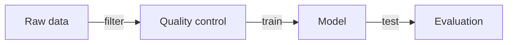

# Diagrams

Use this reference for flowcharts, method pipelines, algorithm workflows, model architectures, system structures, biological pathways, mechanism schematics, and editable diagram sources.

## Choose The Diagram Backend

Use Graphviz when:

- The structure is a directed graph, dependency tree, DAG, hierarchy, or pipeline.
- Layout should be deterministic and reproducible.
- You need `.dot` source and SVG output.

Use Mermaid when:

- The user wants Markdown-native documentation.
- The diagram is a quick workflow, sequence, class, or state diagram.
- The output will live in docs, GitHub, or a paper draft before final polishing.

Use draw.io / diagrams.net when:

- The user needs a hand-editable diagram.
- The final artifact must be adjusted by a collaborator.
- Orthogonal connectors, manual callouts, or journal-specific visual cleanup matter.

Use matplotlib patches when:

- The diagram must be integrated tightly into a multi-panel figure with data plots.
- Colors, text, and geometry need exact manuscript-level control.

## Figure Contract

Before drawing:

- List nodes as nouns.
- List edges as verbs, transformations, or dependencies.
- Classify arrow meaning: sequence, data flow, regulation, containment, or comparison.
- Decide reading direction: left-to-right, top-to-bottom, or hub-and-spoke.
- Identify the most important node or path.

## Visual Style

- Keep background white.
- Use rounded corners sparingly; prefer subtle rectangles for modules.
- Use `0.8-1.2 pt` lines for manuscript diagrams.
- Use muted fills and dark labels.
- Keep node labels under two lines when possible.
- Use one accent color for the key path or novelty.
- Avoid icons unless they clarify a domain object and remain readable in print.

Recommended colors:

```text
node fill:       #F3F6F8
node stroke:     #5B6570
primary path:    #2A9D8F
secondary path:  #3B6FB6
warning/accent:  #C95C54
text:            #202427
```

## Graphviz Conventions

Use `rankdir=LR` for pipelines. Use `rankdir=TB` for protocols and decision trees.

Use HTML-like labels only when the structure needs line breaks or emphasis; otherwise keep labels plain.

Use clusters for phases:

```dot
subgraph cluster_training {
  label="Training";
  style="rounded,dashed";
  preprocess -> fit -> validate;
}
```

Render if Graphviz is installed:

```bash
dot -Tsvg workflow.dot -o workflow.svg
dot -Tpng workflow.dot -o workflow.png
```

## Mermaid Conventions

Use `flowchart LR` for pipelines:



Use explicit IDs and short labels. Avoid long sentences in nodes.

## draw.io Conventions

For editable diagrams:

- Create `.drawio` source when possible.
- Keep connectors orthogonal.
- Use consistent module sizes and aligned anchor points.
- Export PNG for quick preview and SVG/PDF for manuscript use.
- Keep the `.drawio` file next to exported assets.

## Common Diagram Types

Method pipeline:

- Inputs on the left.
- Transformations in the center.
- Outputs and validation on the right.
- Add data dimensions, `n`, or cohort sizes as small annotations.

Model architecture:

- Group encoder, bottleneck, decoder, heads, and losses.
- Use arrows for tensors or information flow.
- Use callouts for novelty only.

Biological mechanism:

- Distinguish physical binding, activation, inhibition, and translocation with different edge styles.
- Avoid implying causality unless supported.

System architecture:

- Separate user/client, service, storage, and external dependencies.
- Show control flow separately from data flow if both matter.

